Propensity Matching and the dm2200 Data
================
Thomas E. Love, Ph.D.
2020-01-26

  - [Setup](#setup)
  - [The `dm2200` data set](#the-dm2200-data-set)
      - [Codebook](#codebook)
      - [Comparing Exposure Groups with
        `tableone`](#comparing-exposure-groups-with-tableone)
  - [Propensity for Exposure](#propensity-for-exposure)
      - [Fitting a Propensity Model](#fitting-a-propensity-model)
          - [Storing the Propensity
            Scores](#storing-the-propensity-scores)
  - [`match_1` 1:1 greedy matching without replacement with the
    `Matching`
    package](#match_1-11-greedy-matching-without-replacement-with-the-matching-package)
      - [ATT vs. ATE vs. ATC estimates](#att-vs.-ate-vs.-atc-estimates)
      - [Obtaining the Matched Sample](#obtaining-the-matched-sample)
      - [Checking Covariate Balance for our 1:1 Greedy
        Match](#checking-covariate-balance-for-our-11-greedy-match)
          - [Using `bal.tab` to obtain a balance
            table](#using-bal.tab-to-obtain-a-balance-table)
          - [Checking Rubin’s Rules 1 and
            2](#checking-rubins-rules-1-and-2)
          - [Using `bal.plot` from
            `cobalt`](#using-bal.plot-from-cobalt)
          - [Using `love.plot` to look at Standardized
            Differences](#using-love.plot-to-look-at-standardized-differences)
          - [Using `love.plot` to look at Variance
            Ratios](#using-love.plot-to-look-at-variance-ratios)
  - [`match_2` 1:2 greedy matching without replacement with the
    `Matching`
    package](#match_2-12-greedy-matching-without-replacement-with-the-matching-package)
      - [Obtaining the Matched Sample](#obtaining-the-matched-sample-1)
      - [Checking Covariate Balance for our 1:2 Greedy
        Match](#checking-covariate-balance-for-our-12-greedy-match)
          - [Using `bal.tab` to obtain a balance
            table](#using-bal.tab-to-obtain-a-balance-table-1)
          - [Checking Rubin’s Rules 1 and
            2](#checking-rubins-rules-1-and-2-1)
          - [Using `bal.plot` from
            `cobalt`](#using-bal.plot-from-cobalt-1)
          - [Using `love.plot` to look at Standardized
            Differences](#using-love.plot-to-look-at-standardized-differences-1)
          - [Using `love.plot` to look at Variance
            Ratios](#using-love.plot-to-look-at-variance-ratios-1)
  - [`match_3` 1:3 matching, with replacement with the `Matching`
    package](#match_3-13-matching-with-replacement-with-the-matching-package)
      - [Obtaining the Matched Sample](#obtaining-the-matched-sample-2)
      - [Checking Covariate Balance for our 1:3
        Match](#checking-covariate-balance-for-our-13-match)
          - [Using `bal.tab` to obtain a balance
            table](#using-bal.tab-to-obtain-a-balance-table-2)
          - [Checking Rubin’s Rules 1 and
            2](#checking-rubins-rules-1-and-2-2)
          - [Using `bal.plot` from
            `cobalt`](#using-bal.plot-from-cobalt-2)
          - [Using `love.plot` to look at Standardized
            Differences](#using-love.plot-to-look-at-standardized-differences-2)
          - [Using `love.plot` to look at Variance
            Ratios](#using-love.plot-to-look-at-variance-ratios-2)
  - [`match_4` Caliper Matching (1:1 without replacement) with the
    `Matching`
    package](#match_4-caliper-matching-11-without-replacement-with-the-matching-package)
      - [Obtaining the Matched Sample](#obtaining-the-matched-sample-3)
      - [Checking Covariate Balance for our 1:1 Caliper
        Match](#checking-covariate-balance-for-our-11-caliper-match)
          - [Using `bal.tab` to obtain a balance
            table](#using-bal.tab-to-obtain-a-balance-table-3)
          - [Checking Rubin’s Rules 1 and
            2](#checking-rubins-rules-1-and-2-3)
          - [Using `bal.plot` from
            `cobalt`](#using-bal.plot-from-cobalt-3)
          - [Using `love.plot` to look at Standardized
            Differences](#using-love.plot-to-look-at-standardized-differences-3)
          - [Using `love.plot` to look at Variance
            Ratios](#using-love.plot-to-look-at-variance-ratios-3)
  - [Planned matches coming as soon as Dr. Love finishes
    them](#planned-matches-coming-as-soon-as-dr.-love-finishes-them)
  - [Outcome Models](#outcome-models)
      - [Unadjusted Models prior to Propensity
        Matching](#unadjusted-models-prior-to-propensity-matching)
          - [Unadjusted Outcome Model for
            `bp_good`](#unadjusted-outcome-model-for-bp_good)
          - [Unadjusted Outcome Model for
            `bmi`](#unadjusted-outcome-model-for-bmi)
      - [Adjusted Outcome Models after
        `match1`](#adjusted-outcome-models-after-match1)
          - [Binary Outcome: `bp_good`](#binary-outcome-bp_good)
          - [Quantitative Outcome: `bmi`](#quantitative-outcome-bmi)
      - [Adjusted Outcome Models after
        `match2`](#adjusted-outcome-models-after-match2)
          - [Binary Outcome: `bp_good`](#binary-outcome-bp_good-1)
          - [Quantitative Outcome: `bmi`](#quantitative-outcome-bmi-1)
      - [Adjusted Outcome Models after
        `match3`](#adjusted-outcome-models-after-match3)
          - [Binary Outcome: `bp_good`](#binary-outcome-bp_good-2)
          - [Quantitative Outcome: `bmi`](#quantitative-outcome-bmi-2)
      - [Adjusted Outcome Models after
        `match4`](#adjusted-outcome-models-after-match4)
          - [Binary Outcome: `bp_good`](#binary-outcome-bp_good-3)
          - [Quantitative Outcome: `bmi`](#quantitative-outcome-bmi-3)
  - [Cleanup](#cleanup)
  - [Key References](#key-references)

This document demonstrates multiple matching strategies incorporating
the propensity score, including the assessment of covariate balance
before and after matching. We focus on binary and quantitative outcomes
in a (simulated) electronic health records data setting. It uses the
`cobalt` package extensively. See the Key References section at the end
of the document.

## Setup

``` r
library(skimr); library(tableone)
library(magrittr); library(janitor) 
library(broom); library(survival); library(lme4)
library(cobalt); library(Matching)
library(tidyverse)

theme_set(theme_bw())
```

``` r
dm2200 <- read_csv("data/dm2200.csv") %>% 
    type.convert() %>% # convert characters to factors
    mutate(subject = as.character(subject),
           bp_good = as.numeric(sbp < 140 & dbp < 90))

dm2200
```

    # A tibble: 2,200 x 26
       subject exposure   age race   hisp sex   insur nincome nhsgrad cleve
       <chr>   <fct>    <int> <fct> <int> <fct> <fct>   <dbl>   <int> <int>
     1 S-0001  A           67 Blac~     0 F     Medi~   24700      72     1
     2 S-0002  B           56 White     0 F     Comm~   62300      85     0
     3 S-0003  B           41 Blac~     0 M     Medi~    6500      49     1
     4 S-0004  A           56 Blac~     0 M     Medi~   45400      86     0
     5 S-0005  B           69 Blac~     0 F     Medi~   15400      72     0
     6 S-0006  B           44 Blac~     0 M     Medi~   34100      87     0
     7 S-0007  B           47 Blac~     0 F     Medi~   13900      42     1
     8 S-0008  B           60 Blac~     0 M     Medi~   30800      91     0
     9 S-0009  B           67 Other     1 F     Medi~   47100      90     1
    10 S-0010  B           70 Blac~     0 F     Medi~   20800      69     1
    # ... with 2,190 more rows, and 16 more variables: height_cm <int>,
    #   weight_kg <int>, bmi <dbl>, a1c <dbl>, sbp <int>, dbp <int>, ldl <int>,
    #   visits <int>, tobacco <fct>, statin <int>, ace_arb <int>, betab <int>,
    #   depr_dx <int>, eyeex <int>, pneumo <int>, bp_good <dbl>

# The `dm2200` data set

I’ve simulated data to match real information we’ve collected over the
years at Better Health Partnership on adults who live with diabetes.
These data mirror some of the real data colleted from electronic health
records across the region by Better Health Partnership, but individual
values have been permuted across patients, so the results are not
applicable to any population. The data I simulated from was a subset of
Better Health data that required that the subject fall into exactly one
of the two exposure groups we’ll study, that they live in Cuyahoga
County, prefer English for health-related communications, and have no
missing data on the variables we’ll study.

  - The *exposure* we’ll study is called `exposure` and consists of two
    levels: A and B. I won’t specify the details further on how the
    exposure is determined, except to say that it is uniquely
    determinable for each subject.
  - We’ll study a binary outcome, specifically whether the subject’s
    blood pressure is in control, in the sense that both their systolic
    blood pressure is below 140 mm Hg, *and* their diastolic blood
    pressure is below 90 mm Hg.
  - We’ll also study a continuous outcome, the subject’s body-mass index
    or `bmi`.

## Codebook

*Note*: I used `paste(colnames(dm2200), collapse = " | ")` to help me
make this list.

|   Variable |       Type        | Description                                                              |
| ---------: | :---------------: | ------------------------------------------------------------------------ |
|    subject |     character     | subject identifier (S-0001 to S-2200)                                    |
|   exposure | factor (2 levels) | A or B                                                                   |
|        age |      integer      | age in years                                                             |
|       race | factor (4 levels) | White, Black\_AA, Asian, Other                                           |
|       hisp |        1/0        | 1 = Hispanic or Latinx, 0 = not                                          |
|        sex |        F/M        | F = Female, M = Male                                                     |
|      insur | factor (4 levels) | Insurance: Medicare, Commercial, Medicaid or Uninsured                   |
|    nincome |      integer      | est. Neighborhood Median Income, in $                                    |
|    nhsgrad |      integer      | est. % of adults in Neighborhood who are High School graduates           |
|      cleve |        1/0        | 1 = Cleveland resident, 0 = resident of suburbs                          |
| height\_cm |      integer      | height in cm                                                             |
| weight\_kg |      integer      | weight in kg                                                             |
|        bmi |      numeric      | body mass index (kg/m<sup>2</sup>)                                       |
|        a1c |      numeric      | most recent Hemoglobin A1c (in %)                                        |
|        sbp |      numeric      | most recent systolic blood pressure (in mm Hg)                           |
|        dbp |      numeric      | most recent diastolic blood pressure (in mm Hg)                          |
|   bp\_good |        1/0        | 1 if `sbp` \< 140 and `dbp` \< 90, 0 otherwise                           |
|        ldl |      numeric      | most recent LDL cholesterol (in mg/dl)                                   |
|     visits |      integer      | primary care office visits in past year                                  |
|    tobacco | factor (3 levels) | Tobacco use: Current, Former, Never                                      |
|     statin |        1/0        | 1 if subject had a statin prescription in the past year                  |
|   ace\_arb |        1/0        | 1 if subject had an ACE inhibitor or ARB prescription in the past year   |
|      betab |        1/0        | 1 if subject had a beta-blocker prescription in the past year            |
|   depr\_dx |        1/0        | 1 if the subject has a depression diagnosis                              |
|      eyeex |        1/0        | 1 if the subject has had a retinal eye exam in the past year             |
|     pneumo |        1/0        | 1 if the subject has had a pneumococcal vaccination in the past 10 years |

## Comparing Exposure Groups with `tableone`

``` r
t1 <- CreateTableOne(
    vars = c("age", "race", "hisp", "sex", "insur", 
             "nincome", "nhsgrad", "cleve", "sbp", "dbp",
             "ldl", "visits", "tobacco", "statin", 
             "ace_arb", "betab", "depr_dx", "eyeex", 
             "pneumo", "bmi", "bp_good"), 
    factorVars = c("hisp", "cleve", "statin",
                   "ace_arb", "betab", "depr_dx", 
                   "eyeex", "pneumo", "bp_good"),
    strata = "exposure", 
    data = dm2200)

t1
```

``` 
                     Stratified by exposure
                      A                   B                   p      test
  n                        200                2000                       
  age (mean (SD))        54.90 (8.55)        58.90 (9.83)     <0.001     
  race (%)                                                    <0.001     
     Asian                   2 ( 1.0)           25 ( 1.2)                
     Black_AA              166 (83.0)         1065 (53.2)                
     Other                   1 ( 0.5)           74 ( 3.7)                
     White                  31 (15.5)          836 (41.8)                
  hisp = 1 (%)               4 ( 2.0)          104 ( 5.2)      0.068     
  sex = M (%)              128 (64.0)          842 (42.1)     <0.001     
  insur (%)                                                   <0.001     
     Commercial              7 ( 3.5)          510 (25.5)                
     Medicaid              125 (62.5)          501 (25.1)                
     Medicare               37 (18.5)          913 (45.6)                
     Uninsured              31 (15.5)           76 ( 3.8)                
  nincome (mean (SD)) 26927.50 (11642.18) 37992.55 (20854.20) <0.001     
  nhsgrad (mean (SD))    77.73 (11.50)       82.23 (11.35)    <0.001     
  cleve = 1 (%)            181 (90.5)         1109 (55.5)     <0.001     
  sbp (mean (SD))       135.88 (20.60)      132.44 (16.17)     0.005     
  dbp (mean (SD))        82.47 (9.08)        72.41 (11.94)    <0.001     
  ldl (mean (SD))        94.34 (38.62)       97.22 (36.66)     0.293     
  visits (mean (SD))      4.81 (2.62)         3.69 (1.78)     <0.001     
  tobacco (%)                                                 <0.001     
     Current               108 (54.0)          445 (22.2)                
     Former                 46 (23.0)          775 (38.8)                
     Never                  46 (23.0)          780 (39.0)                
  statin = 1 (%)           154 (77.0)         1603 (80.2)      0.334     
  ace_arb = 1 (%)          160 (80.0)         1531 (76.5)      0.310     
  betab = 1 (%)             53 (26.5)          781 (39.1)      0.001     
  depr_dx = 1 (%)           53 (26.5)          753 (37.6)      0.002     
  eyeex = 1 (%)            104 (52.0)         1225 (61.3)      0.013     
  pneumo = 1 (%)           116 (58.0)         1766 (88.3)     <0.001     
  bmi (mean (SD))        32.83 (8.22)        35.09 (8.17)     <0.001     
  bp_good = 1 (%)          117 (58.5)         1431 (71.5)     <0.001     
```

# Propensity for Exposure

We’ll fit a logistic regression model to predict propensity for exposure
`A` (as compared to `B`), on the basis of these 18 covariates:

  - age, race, hisp, sex, insur, nincome, nhsgrad, cleve,
  - a1c, ldl, visits, tobacco, statin, ace\_arb, betab,
  - depr\_dx, eyeex, pneumo

Practically, we might well fit something more complex than a simple
model with main effects, but that’s what we’ll limit ourselves to in
this setting. Note that we’re not including any direct information on
either of our outcomes, or the elements that go into them. In practical
work, we might fit different propensity scores for each outcome, but
we’re keeping things simple here.

## Fitting a Propensity Model

We’ll use the `f.build` tool from the `cobalt` package here.

``` r
dm2200 <- dm2200 %>%
    mutate(treat = as.logical(exposure == "A"))

covs_1 <- dm2200 %>%
    select(age, race, hisp, sex, insur, nincome,
           nhsgrad, cleve, a1c, ldl, visits, tobacco,
           statin, ace_arb, betab, depr_dx, eyeex, pneumo)

prop_model <- glm(f.build("treat", covs_1), data = dm2200,
                  family = binomial)

tidy(prop_model, conf.int = TRUE) %>%
    select(term, estimate, std.error, conf.low, conf.high, p.value) %>%
    knitr::kable(digits = 3)
```

| term           | estimate | std.error | conf.low | conf.high | p.value |
| :------------- | -------: | --------: | -------: | --------: | ------: |
| (Intercept)    |  \-4.285 |     1.628 |  \-7.645 |   \-1.225 |   0.008 |
| age            |    0.012 |     0.012 |  \-0.011 |     0.037 |   0.305 |
| raceBlack\_AA  |  \-0.048 |     1.011 |  \-1.787 |     2.257 |   0.962 |
| raceOther      |  \-2.176 |     1.513 |  \-5.585 |     0.789 |   0.150 |
| raceWhite      |  \-1.180 |     1.028 |  \-2.963 |     1.147 |   0.251 |
| hisp           |    0.040 |     0.633 |  \-1.347 |     1.183 |   0.949 |
| sexM           |    0.831 |     0.190 |    0.461 |     1.208 |   0.000 |
| insurMedicaid  |    2.422 |     0.418 |    1.669 |     3.330 |   0.000 |
| insurMedicare  |    0.961 |     0.452 |    0.126 |     1.922 |   0.034 |
| insurUninsured |    3.246 |     0.480 |    2.351 |     4.256 |   0.000 |
| nincome        |    0.000 |     0.000 |    0.000 |     0.000 |   0.803 |
| nhsgrad        |  \-0.004 |     0.010 |  \-0.023 |     0.015 |   0.677 |
| cleve          |    1.812 |     0.320 |    1.208 |     2.468 |   0.000 |
| a1c            |  \-0.038 |     0.047 |  \-0.132 |     0.052 |   0.412 |
| ldl            |  \-0.004 |     0.003 |  \-0.009 |     0.001 |   0.104 |
| visits         |    0.268 |     0.041 |    0.186 |     0.349 |   0.000 |
| tobaccoFormer  |  \-1.134 |     0.227 |  \-1.586 |   \-0.695 |   0.000 |
| tobaccoNever   |  \-1.023 |     0.225 |  \-1.471 |   \-0.587 |   0.000 |
| statin         |    0.006 |     0.228 |  \-0.434 |     0.461 |   0.978 |
| ace\_arb       |    0.384 |     0.229 |  \-0.055 |     0.844 |   0.093 |
| betab          |  \-0.260 |     0.204 |  \-0.665 |     0.135 |   0.202 |
| depr\_dx       |  \-0.664 |     0.208 |  \-1.078 |   \-0.263 |   0.001 |
| eyeex          |  \-0.325 |     0.191 |  \-0.699 |     0.050 |   0.089 |
| pneumo         |  \-1.612 |     0.211 |  \-2.027 |   \-1.200 |   0.000 |

``` r
glance(prop_model)
```

    # A tibble: 1 x 7
      null.deviance df.null logLik   AIC   BIC deviance df.residual
              <dbl>   <int>  <dbl> <dbl> <dbl>    <dbl>       <int>
    1         1340.    2199  -416.  880. 1016.     832.        2176

### Storing the Propensity Scores

``` r
dm2200 <- dm2200 %>%
    mutate(ps = prop_model$fitted,
           linps = prop_model$linear.predictors)

ggplot(dm2200, aes(x = exposure, y = linps)) +
    geom_violin() +
    geom_boxplot(width = 0.3)
```

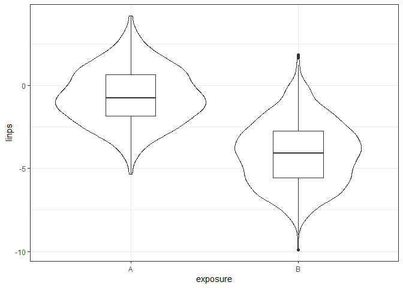<!-- -->

# `match_1` 1:1 greedy matching without replacement with the `Matching` package

We’re going to match on the linear propensity score, and define our
`treat` (treatment) as occurring when `exposure` is A.

``` r
match_1 <- Match(Tr = dm2200$treat, X = dm2200$linps, 
                 M = 1, replace = FALSE, ties = FALSE,
                 estimand = "ATT")

summary(match_1)
```

``` 

Estimate...  0 
SE.........  0 
T-stat.....  NaN 
p.val......  NA 

Original number of observations..............  2200 
Original number of treated obs...............  200 
Matched number of observations...............  200 
Matched number of observations  (unweighted).  200 
```

## ATT vs. ATE vs. ATC estimates

Note that in each of the matched samples we build, we’ll focus on ATT
estimates (average treated effect on the treated) rather than ATE
estimates. This means that in our matching we’re trying to mirror the
population represented by the “treated” sample we observed.

  - To obtain ATE estimates rather than ATT with the `Match` function
    from the `Matching` package, use `estimand = "ATE"` in the process
    of developing the matched sample.
  - To obtain ATC estimates (average treatment effect on the controls),
    use `estimand = "ATC"`.

I encourage the use of ATT estimates in your projects, where possible. I
suggest also that you define the “treated” group (the one that the
propensity score is estimating) to be the smaller of the two groups you
have, to facilitate this approach. If you estimate ATE or ATC instead of
ATT, of course, you are answering a different question than what ATT
resolves.

## Obtaining the Matched Sample

Now, we build a new matched sample data frame in order to do some of the
analyses to come. This will contain only the matched subjects.

``` r
match1_matches <- factor(rep(match_1$index.treated, 2))
dm2200_matched1 <- cbind(match1_matches, 
                         dm2200[c(match_1$index.control, 
                                  match_1$index.treated),])
```

Some sanity checks:

``` r
dm2200_matched1 %>% count(exposure)
```

    # A tibble: 2 x 2
      exposure     n
      <fct>    <int>
    1 A          200
    2 B          200

``` r
dm2200_matched1 %>% head()
```

``` 
  match1_matches subject exposure age     race hisp sex     insur nincome
1              1  S-0728        B  64 Black_AA    0   F  Medicaid   12600
2              4  S-1650        B  48 Black_AA    0   M  Medicaid   22100
3             17  S-0834        B  61 Black_AA    0   M  Medicaid   31500
4             26  S-1705        B  72 Black_AA    0   F  Medicare   19600
5             27  S-0678        B  36 Black_AA    0   F  Medicaid   16600
6             37  S-0765        B  39 Black_AA    0   M Uninsured   35000
  nhsgrad cleve height_cm weight_kg  bmi  a1c sbp dbp ldl visits tobacco statin
1      78     1       152        81 35.1  6.9 134  76 140      3  Former      1
2      80     1       172       134 45.3  5.1  98  66 121      3   Never      1
3      80     1       183        94 28.1  6.5 127  79 137      3 Current      1
4      87     1       152        74 32.0  6.8 134  69 129      4 Current      1
5      79     1       160        80 31.3 14.5 142  95 157      5 Current      1
6      82     0       185       125 36.5  7.3 138  83 119      4 Current      1
  ace_arb betab depr_dx eyeex pneumo bp_good treat         ps      linps
1       1     1       1     1      1       1 FALSE 0.03767221 -3.2404325
2       1     0       0     0      0       1 FALSE 0.62855155  0.5260079
3       1     0       1     0      1       1 FALSE 0.33963493 -0.6649215
4       1     1       0     1      1       1 FALSE 0.07539326 -2.5066506
5       0     1       0     1      0       0 FALSE 0.40466703 -0.3860563
6       1     0       1     1      0       1 FALSE 0.41908241 -0.3265413
```

## Checking Covariate Balance for our 1:1 Greedy Match

### Using `bal.tab` to obtain a balance table

``` r
covs_1plus <- dm2200 %>%
    select(age, race, hisp, sex, insur, nincome,
           nhsgrad, cleve, a1c, ldl, visits, tobacco,
           statin, ace_arb, betab, depr_dx, eyeex, pneumo,
           ps, linps)

bal1 <- bal.tab(M = match_1,
                treat = dm2200$exposure,
                covs = covs_1plus, quick = FALSE,
                un = TRUE, disp.v.ratio = TRUE)
bal1
```

    Balance Measures
                        Type Diff.Un V.Ratio.Un Diff.Adj V.Ratio.Adj
    age              Contin.  0.4076     1.3195  -0.0952      1.3038
    race_Asian        Binary  0.0025              0.0000            
    race_Black_AA     Binary -0.2975              0.0100            
    race_Other        Binary  0.0320              0.0000            
    race_White        Binary  0.2630             -0.0100            
    hisp              Binary  0.0320              0.0000            
    sex_M             Binary -0.2190             -0.0550            
    insur_Commercial  Binary  0.2200             -0.0100            
    insur_Medicaid    Binary -0.3745              0.0100            
    insur_Medicare    Binary  0.2715              0.0100            
    insur_Uninsured   Binary -0.1170             -0.0100            
    nincome          Contin.  0.5306     3.2086  -0.0073      1.3392
    nhsgrad          Contin.  0.3958     0.9727   0.0203      0.9329
    cleve             Binary -0.3505             -0.0200            
    a1c              Contin. -0.0419     0.8190  -0.0056      1.0616
    ldl              Contin.  0.0783     0.9012  -0.0177      0.9128
    visits           Contin. -0.6304     0.4602  -0.2445      0.8057
    tobacco_Current   Binary -0.3175             -0.0150            
    tobacco_Former    Binary  0.1575              0.0300            
    tobacco_Never     Binary  0.1600             -0.0150            
    statin            Binary  0.0315             -0.0400            
    ace_arb           Binary -0.0345             -0.0200            
    betab             Binary  0.1255              0.0350            
    depr_dx           Binary  0.1115              0.0650            
    eyeex             Binary  0.0925              0.0450            
    pneumo            Binary  0.3030              0.0750            
    ps               Contin. -2.9189     0.1576  -0.7382      0.4790
    linps            Contin. -1.7842     1.3395  -0.2126      0.5378
    
    Sample sizes
                A    B
    All       200 2000
    Matched   200  200
    Unmatched   0 1800

### Checking Rubin’s Rules 1 and 2

We’ll build a little table of the Rubin’s Rules (1 and 2) before and
after our `match_1` is applied.

``` r
covs_for_rubin <- dm2200 %>%
    select(linps)

rubin_m1 <- bal.tab(M = match_1,
                treat = dm2200$treat,
                covs = covs_for_rubin, 
                un = TRUE, disp.v.ratio = TRUE)[1]

rubin_report_m1 <- tibble(
    status = c("Rule1", "Rule2"),
    Unmatched = c(rubin_m1$Balance$Diff.Un,
                  rubin_m1$Balance$V.Ratio.Un),
    Matched = c(rubin_m1$Balance$Diff.Adj,
               rubin_m1$Balance$V.Ratio.Adj))

rubin_report_m1 %>% knitr::kable(digits = 2)
```

| status | Unmatched | Matched |
| :----- | --------: | ------: |
| Rule1  |      2.07 |    0.25 |
| Rule2  |      0.75 |    1.86 |

  - The Rule 1 results tell us about the standardized differences
    expressed as proportions, so we’d like to be certain that our
    results are as close to zero as possible, and definitely below 0.5
    in absolute value.
      - Multiply these by 100 to describe them as percentages, adjusting
        the cutoff to below 50 in absolute value.
      - Here, before matching we have a bias of 206.5005338%, and this
        is reduced to 24.6020536% after 1:1 greedy matching.
  - The Rule 2 results tell us about the variance ratio of the linear
    propensity scores. We want this to be within (0.5, 2) and ideally
    within (0.8, 1.25).
      - Here, before matching we have a variance ratio of 74.6560482%,
        and this becomes 185.9561302% after 1:1 greedy matching.

### Using `bal.plot` from `cobalt`

We can look at any particular variable with this approach, for example,
age:

``` r
bal.plot(obj = match_1,
         treat = dm2200$exposure,
         covs = covs_1plus,
         var.name = "age", 
         which = "both",
         sample.names = 
             c("Unmatched Sample", "Matched Sample"))
```

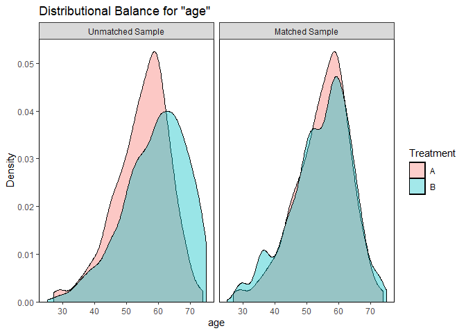<!-- -->

We could also look at the propensity scores in each group, perhaps in
mirrored histograms, with …

``` r
bal.plot(obj = match_1,
         treat = dm2200$exposure,
         covs = covs_1plus,
         var.name = "ps", 
         which = "both",
         sample.names = 
             c("Unmatched Sample", "Matched Sample"),
         type = "histogram", mirror = TRUE)
```

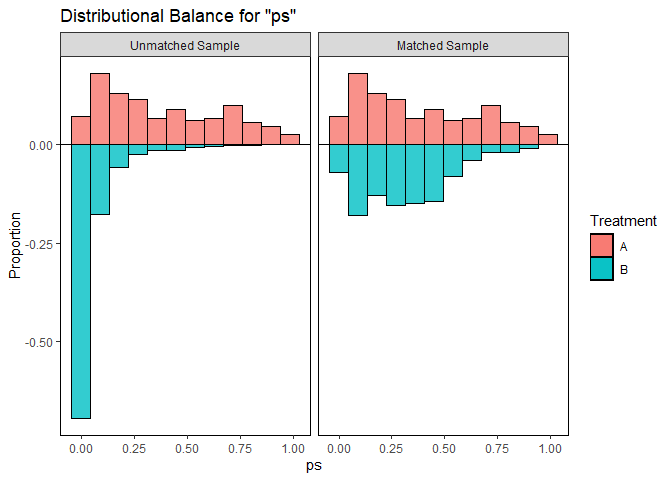<!-- -->

Can we look at a categorical variable this way?

``` r
bal.plot(obj = match_1,
         treat = dm2200$exposure,
         covs = covs_1plus,
         var.name = "insur", 
         which = "both",
         sample.names = 
             c("Unmatched Sample", "Matched Sample"))
```

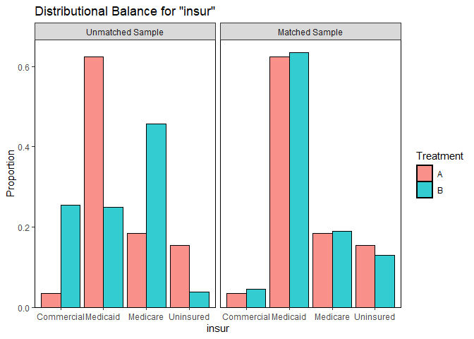<!-- -->

### Using `love.plot` to look at Standardized Differences

``` r
love.plot(bal1, 
          threshold = .1, size = 3,
          var.order = "unadjusted",
          stats = "mean.diffs",
          stars = "raw",
          sample.names = c("Unmatched", "Matched"),
          title = "Love Plot for our 1:1 Match") +
    labs(caption = "* indicates raw mean differences (for binary variables)")
```

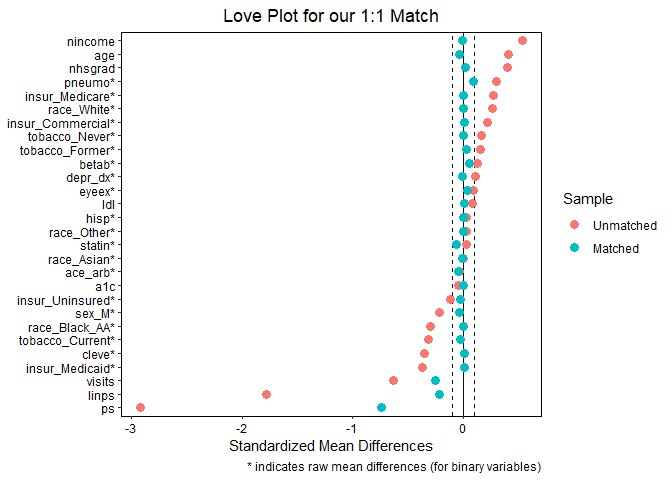<!-- -->

``` r
love.plot(bal1, 
          threshold = .1, size = 3,
          var.order = "unadjusted",
          stats = "mean.diffs",
          stars = "raw",
          abs = TRUE,
          sample.names = c("Unmatched", "Matched"),
          title = "Absolute Differences for 1:1 Match") +
    labs(caption = "* indicates raw mean differences (for binary variables)")
```

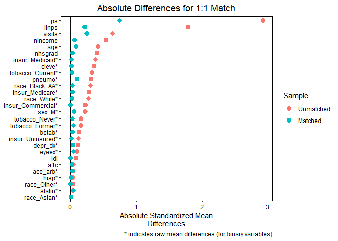<!-- -->

### Using `love.plot` to look at Variance Ratios

Note that this will only include the variables (and summaries like `ps`
and `linps`) that describe quantities. Categorical variables are
dropped.

``` r
love.plot(bal1, 
          threshold = .5, size = 3,
          stats = "variance.ratios",
          sample.names = c("Unmatched", "Matched"),
          title = "Variance Ratios for our 1:1 Match") 
```

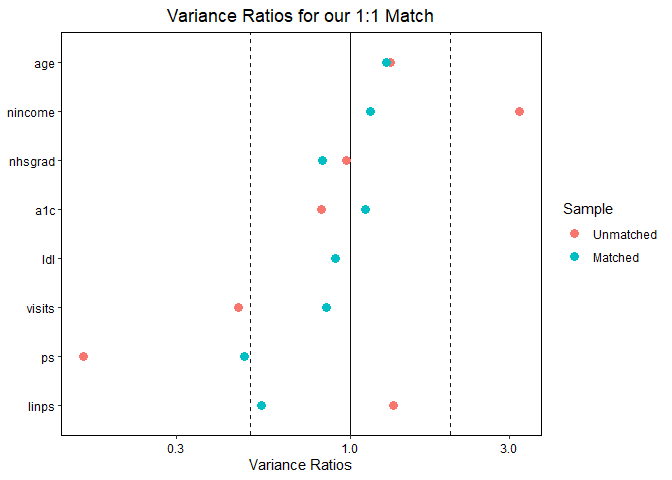<!-- -->

# `match_2` 1:2 greedy matching without replacement with the `Matching` package

Again, we’ll match on the linear propensity score, and define our
`treat` (treatment) as occurring when `exposure` is A. The only
difference will be that we’ll allow each subject with exposure A to be
matched to exactly two subjects with exposure B.

``` r
match_2 <- Match(Tr = dm2200$treat, X = dm2200$linps, 
                 M = 2, replace = FALSE, ties = FALSE,
                 estimand = "ATT")

summary(match_2)
```

``` 

Estimate...  0 
SE.........  0 
T-stat.....  NaN 
p.val......  NA 

Original number of observations..............  2200 
Original number of treated obs...............  200 
Matched number of observations...............  200 
Matched number of observations  (unweighted).  400 
```

Note that we now have 400 matched exposure “B” subjects in our matched
sample.

## Obtaining the Matched Sample

As before,

``` r
match2_matches <- factor(rep(match_2$index.treated, 2))
dm2200_matched2 <- cbind(match2_matches, 
                         dm2200[c(match_2$index.control, 
                                  match_2$index.treated),])
```

How many unique subjects are in our matched sample?

``` r
dm2200_matched2 %$% n_distinct(subject)
```

    [1] 600

This match repeats each exposure A subject twice, to match up with the
400 exposure B subjects.

``` r
dm2200_matched2 %>% count(exposure)
```

    # A tibble: 2 x 2
      exposure     n
      <fct>    <int>
    1 A          400
    2 B          400

``` r
dm2200_matched2 %>% count(subject, exposure)
```

    # A tibble: 600 x 3
       subject exposure     n
       <chr>   <fct>    <int>
     1 S-0001  A            2
     2 S-0004  A            2
     3 S-0007  B            1
     4 S-0008  B            1
     5 S-0010  B            1
     6 S-0014  B            1
     7 S-0017  A            2
     8 S-0020  B            1
     9 S-0026  A            2
    10 S-0027  A            2
    # ... with 590 more rows

## Checking Covariate Balance for our 1:2 Greedy Match

### Using `bal.tab` to obtain a balance table

``` r
covs_2plus <- dm2200 %>%
    select(age, race, hisp, sex, insur, nincome,
           nhsgrad, cleve, a1c, ldl, visits, tobacco,
           statin, ace_arb, betab, depr_dx, eyeex, pneumo,
           ps, linps)

bal2 <- bal.tab(M = match_2,
                treat = dm2200$exposure,
                covs = covs_2plus, quick = FALSE,
                un = TRUE, disp.v.ratio = TRUE)
bal2
```

    Balance Measures
                        Type Diff.Un V.Ratio.Un Diff.Adj V.Ratio.Adj
    age              Contin.  0.4076     1.3195   0.0773      1.2896
    race_Asian        Binary  0.0025              0.0000            
    race_Black_AA     Binary -0.2975             -0.0225            
    race_Other        Binary  0.0320              0.0000            
    race_White        Binary  0.2630              0.0225            
    hisp              Binary  0.0320              0.0050            
    sex_M             Binary -0.2190             -0.0775            
    insur_Commercial  Binary  0.2200             -0.0100            
    insur_Medicaid    Binary -0.3745             -0.0450            
    insur_Medicare    Binary  0.2715              0.0950            
    insur_Uninsured   Binary -0.1170             -0.0400            
    nincome          Contin.  0.5306     3.2086  -0.0084      1.3369
    nhsgrad          Contin.  0.3958     0.9727   0.0134      1.0964
    cleve             Binary -0.3505             -0.0150            
    a1c              Contin. -0.0419     0.8190  -0.0416      0.8261
    ldl              Contin.  0.0783     0.9012   0.0104      0.9261
    visits           Contin. -0.6304     0.4602  -0.2965      0.7321
    tobacco_Current   Binary -0.3175             -0.1100            
    tobacco_Former    Binary  0.1575              0.0700            
    tobacco_Never     Binary  0.1600              0.0400            
    statin            Binary  0.0315              0.0075            
    ace_arb           Binary -0.0345             -0.0125            
    betab             Binary  0.1255              0.0400            
    depr_dx           Binary  0.1115              0.0625            
    eyeex             Binary  0.0925              0.0450            
    pneumo            Binary  0.3030              0.1525            
    ps               Contin. -2.9189     0.1576  -1.4655      0.3428
    linps            Contin. -1.7842     1.3395  -0.4321      0.4092
    
    Sample sizes
                A    B
    All       200 2000
    Matched   200  400
    Unmatched   0 1600

### Checking Rubin’s Rules 1 and 2

We’ll build a little table of the Rubin’s Rules (1 and 2) before and
after our 1:2 greedy `match_2` is applied, and compare these to the
results we found in `match_1` (the 1:1 match).

``` r
covs_for_rubin <- dm2200 %>%
    select(linps)

rubin_m2 <- bal.tab(M = match_2,
                treat = dm2200$treat,
                covs = covs_for_rubin, 
                un = TRUE, disp.v.ratio = TRUE)[1]

rubin_report_m12 <- tibble(
    status = c("Rule1", "Rule2"),
    Unmatched = c(rubin_m2$Balance$Diff.Un,
                  rubin_m2$Balance$V.Ratio.Un),
    Match1 = c(rubin_m1$Balance$Diff.Adj,
               rubin_m1$Balance$V.Ratio.Adj),
    Match2 = c(rubin_m2$Balance$Diff.Adj,
               rubin_m2$Balance$V.Ratio.Adj))

rubin_report_m12 %>% knitr::kable(digits = 2)
```

| status | Unmatched | Match1 | Match2 |
| :----- | --------: | -----: | -----: |
| Rule1  |      2.07 |   0.25 |   0.50 |
| Rule2  |      0.75 |   1.86 |   2.44 |

  - Again, we’d like to see Rule 1 as close to zero as possible, and
    definitely below 0.5 in absolute value. Unsurprisingly, when we have
    to match *two* exposure B subjects to each exposure A subject, we
    don’t get matches that are as close.
  - The Rule 2 results tell us about the variance ratio of the linear
    propensity scores. We want this to be within (0.5, 2) and ideally
    within (0.8, 1.25). Again, here the results are a bit disappointing
    in comparison to what we saw in our 1:1 match.

### Using `bal.plot` from `cobalt`

Looking at the propensity scores in each group, perhaps in mirrored
histograms, we have …

``` r
bal.plot(obj = match_2,
         treat = dm2200$exposure,
         covs = covs_2plus,
         var.name = "ps", 
         which = "both",
         sample.names = 
             c("Unmatched Sample", "match_2 Sample"),
         type = "histogram", mirror = TRUE)
```

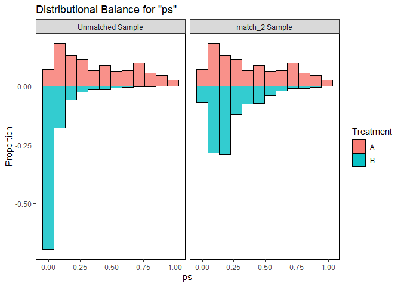<!-- -->

### Using `love.plot` to look at Standardized Differences

``` r
love.plot(bal2, 
          threshold = .1, size = 3,
          var.order = "unadjusted",
          stats = "mean.diffs",
          stars = "raw",
          sample.names = c("Unmatched", "Matched"),
          title = "Love Plot for our 1:2 Match") +
    labs(caption = "* indicates raw mean differences (for binary variables)")
```

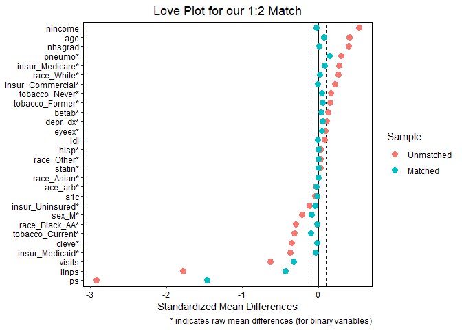<!-- -->

### Using `love.plot` to look at Variance Ratios

Again, the categorical variables are dropped.

``` r
love.plot(bal2, 
          threshold = .5, size = 3,
          stats = "variance.ratios",
          sample.names = c("Unmatched", "Matched"),
          title = "Variance Ratios for our 1:2 Match") 
```

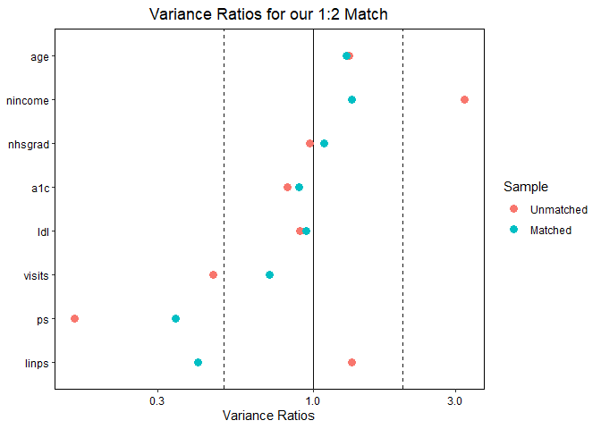<!-- -->

# `match_3` 1:3 matching, with replacement with the `Matching` package

Again, we’ll match on the linear propensity score, and define our
`treat` (treatment) as occurring when `exposure` is A. But now, we’ll
match *with* replacement (which means that multiple subject with
exposure A can be matched to the same subject with exposure B) and we’ll
also match each subject with exposure A to be matched to exactly three
subjects with exposure B.

``` r
match_3 <- Match(Tr = dm2200$treat, X = dm2200$linps, 
                 M = 3, replace = TRUE, ties = FALSE,
                 estimand = "ATT")

summary(match_3)
```

``` 

Estimate...  0 
SE.........  0 
T-stat.....  NaN 
p.val......  NA 

Original number of observations..............  2200 
Original number of treated obs...............  200 
Matched number of observations...............  200 
Matched number of observations  (unweighted).  600 
```

Note that we now have 600 matched exposure “B” subjects in our matched
sample.

## Obtaining the Matched Sample

As before,

``` r
match3_matches <- factor(rep(match_3$index.treated, 2))
dm2200_matched3 <- cbind(match3_matches, 
                         dm2200[c(match_3$index.control, 
                                  match_3$index.treated),])
```

If this was being done without replacement, this would repeat each
exposure A subject three times, to match up with the 600 exposure B
subjects. But here, we have a different result.

How many unique subjects are in our matched sample?

``` r
dm2200_matched3 %$% n_distinct(subject)
```

    [1] 504

How many of those are in Exposure A?

``` r
dm2200_matched3 %>% filter(exposure == "A") %$% n_distinct(subject)
```

    [1] 200

How many of those are in Exposure B?

``` r
dm2200_matched3 %>% filter(exposure == "B") %$% n_distinct(subject)
```

    [1] 304

Among those exposure A subjects, how many times were they used in the
matches?

``` r
dm2200_matched3 %>% filter(exposure == "A") %>% 
    count(subject) %>%
    tabyl(n)
```

``` 
 n n_n percent
 3 200       1
```

Among those exposure B subjects, how many times were they used in the
matches?

``` r
dm2200_matched3 %>% filter(exposure == "B") %>% 
    count(subject) %>%
    tabyl(n)
```

``` 
  n n_n     percent
  1 200 0.657894737
  2  57 0.187500000
  3  23 0.075657895
  4   6 0.019736842
  5   4 0.013157895
  6   2 0.006578947
  7   1 0.003289474
  8   1 0.003289474
  9   2 0.006578947
 10   2 0.006578947
 13   2 0.006578947
 15   1 0.003289474
 20   1 0.003289474
 23   1 0.003289474
 24   1 0.003289474
```

## Checking Covariate Balance for our 1:3 Match

### Using `bal.tab` to obtain a balance table

``` r
covs_3plus <- dm2200 %>%
    select(age, race, hisp, sex, insur, nincome,
           nhsgrad, cleve, a1c, ldl, visits, tobacco,
           statin, ace_arb, betab, depr_dx, eyeex, pneumo,
           ps, linps)

bal3 <- bal.tab(M = match_3,
                treat = dm2200$exposure,
                covs = covs_3plus, quick = FALSE,
                un = TRUE, disp.v.ratio = TRUE)
bal3
```

    Balance Measures
                        Type Diff.Un V.Ratio.Un Diff.Adj V.Ratio.Adj
    age              Contin.  0.4076     1.3195  -0.0695      1.3448
    race_Asian        Binary  0.0025             -0.0033            
    race_Black_AA     Binary -0.2975              0.0233            
    race_Other        Binary  0.0320             -0.0017            
    race_White        Binary  0.2630             -0.0183            
    hisp              Binary  0.0320             -0.0067            
    sex_M             Binary -0.2190              0.0067            
    insur_Commercial  Binary  0.2200             -0.0083            
    insur_Medicaid    Binary -0.3745             -0.0317            
    insur_Medicare    Binary  0.2715              0.0250            
    insur_Uninsured   Binary -0.1170              0.0150            
    nincome          Contin.  0.5306     3.2086   0.0165      1.3475
    nhsgrad          Contin.  0.3958     0.9727  -0.0541      0.8348
    cleve             Binary -0.3505              0.0067            
    a1c              Contin. -0.0419     0.8190  -0.0619      1.0048
    ldl              Contin.  0.0783     0.9012   0.0955      1.0295
    visits           Contin. -0.6304     0.4602  -0.0984      0.8184
    tobacco_Current   Binary -0.3175             -0.0267            
    tobacco_Former    Binary  0.1575              0.0533            
    tobacco_Never     Binary  0.1600             -0.0267            
    statin            Binary  0.0315             -0.0250            
    ace_arb           Binary -0.0345             -0.0050            
    betab             Binary  0.1255             -0.0283            
    depr_dx           Binary  0.1115              0.0117            
    eyeex             Binary  0.0925              0.0133            
    pneumo            Binary  0.3030             -0.0083            
    ps               Contin. -2.9189     0.1576  -0.0383      0.9511
    linps            Contin. -1.7842     1.3395  -0.0267      0.8893
    
    Sample sizes
                           A        B
    All                  200 2000.000
    Matched (ESS)        200  104.469
    Matched (Unweighted) 200  304.000
    Unmatched              0 1696.000

### Checking Rubin’s Rules 1 and 2

We’ll build a little table of the Rubin’s Rules (1 and 2) before and
after our 1:2 greedy `match_2` is applied, and compare these to the
results we found in `match_1` (the 1:1 match).

``` r
covs_for_rubin <- dm2200 %>%
    select(linps)

rubin_m3 <- bal.tab(M = match_3,
                treat = dm2200$treat,
                covs = covs_for_rubin, 
                un = TRUE, disp.v.ratio = TRUE)[1]

rubin_report_m123 <- tibble(
    status = c("Rule1", "Rule2"),
    Unmatched = c(rubin_m2$Balance$Diff.Un,
                  rubin_m2$Balance$V.Ratio.Un),
    Match1 = c(rubin_m1$Balance$Diff.Adj,
               rubin_m1$Balance$V.Ratio.Adj),
    Match2 = c(rubin_m2$Balance$Diff.Adj,
               rubin_m2$Balance$V.Ratio.Adj),
    Match3 = c(rubin_m3$Balance$Diff.Adj,
               rubin_m3$Balance$V.Ratio.Adj))


rubin_report_m123 %>% knitr::kable(digits = 2)
```

| status | Unmatched | Match1 | Match2 | Match3 |
| :----- | --------: | -----: | -----: | -----: |
| Rule1  |      2.07 |   0.25 |   0.50 |   0.03 |
| Rule2  |      0.75 |   1.86 |   2.44 |   1.12 |

  - Again, we’d like to see Rule 1 results as close to zero as possible,
    and definitely below 0.5 in absolute value.
  - In Rule 2, we want the variance ratio of the linear propensity
    scores to be within (0.5, 2) and ideally within (0.8, 1.25).
  - It appears that (in these data) allowing the same exposure B subject
    to be used for multiple matches (matching with replacement) more
    than makes up for the fact that matching 3 exposure B’s for each
    exposure A (1:3 matching) is a tougher job than pair (1:1) matching,
    as seen in the results for Rubin’s Rule 1 and Rule 2.

### Using `bal.plot` from `cobalt`

Looking at the propensity scores in each group, perhaps in mirrored
histograms, we have …

``` r
bal.plot(obj = match_3,
         treat = dm2200$exposure,
         covs = covs_3plus,
         var.name = "ps", 
         which = "both",
         sample.names = 
             c("Unmatched Sample", "match_3 Sample"),
         type = "histogram", mirror = TRUE)
```

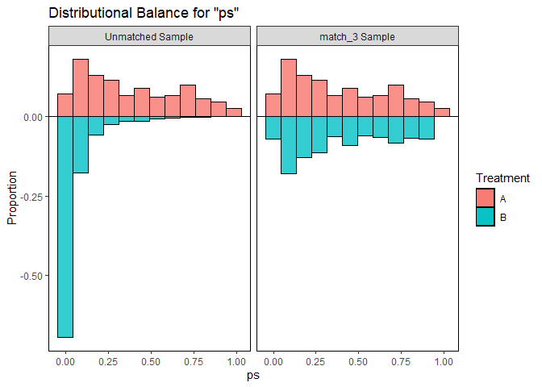<!-- -->

### Using `love.plot` to look at Standardized Differences

``` r
love.plot(bal3, 
          threshold = .1, size = 3,
          var.order = "unadjusted",
          stats = "mean.diffs",
          stars = "raw",
          abs = TRUE,
          sample.names = c("Unmatched", "Matched"),
          title = "Love Plot of |Mean Differences| for our 1:3 Match") +
    labs(caption = "* indicates raw mean differences (for binary variables)")
```

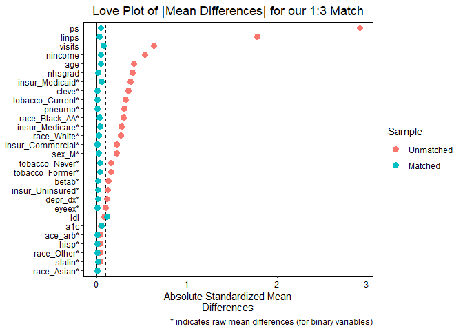<!-- -->

### Using `love.plot` to look at Variance Ratios

Again, the categorical variables are dropped.

``` r
love.plot(bal3, 
          threshold = .5, size = 3,
          stats = "variance.ratios",
          sample.names = c("Unmatched", "Matched"),
          title = "Variance Ratios for our 1:3 Match") 
```

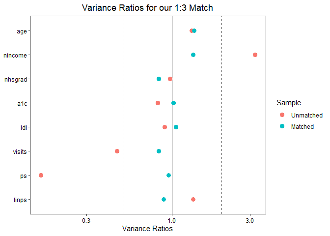<!-- -->

# `match_4` Caliper Matching (1:1 without replacement) with the `Matching` package

The `Match` function in the `Matching` package allows you to specify a
caliper. From the `Matching` help file:

  - A caliper is the maximum acceptable distance (on a covariate) which
    we are willing to accept in any match. Observations for which we
    cannot find a match within the caliper are dropped.Dropping
    observations generally changes the quantity being estimated.
  - The caliper is interpreted to be in standardized units. For example,
    caliper=.25 means that all matches not equal to or within .25
    standard deviations of each covariate in X are dropped, and not
    matched.
      - If a scalar caliper is provided to the `caliper` setting in the
        `Match` function, this caliper is used for all covariates in X.
      - If a vector of calipers is provided, a caliper value should be
        provided for each covariate in X.

We’ll again perform a 1:1 match without replacement, but now we’ll do so
while only accepting matches where the linear propensity score of each
match is within 0.2 standard deviations of the linear PS.

``` r
match_4 <- Match(Tr = dm2200$treat, X = dm2200$linps, 
                 M = 1, replace = FALSE, ties = FALSE,
                 caliper = 0.2, estimand = "ATT")

summary(match_4)
```

``` 

Estimate...  0 
SE.........  0 
T-stat.....  NaN 
p.val......  NA 

Original number of observations..............  2200 
Original number of treated obs...............  200 
Matched number of observations...............  162 
Matched number of observations  (unweighted).  162 

Caliper (SDs)........................................   0.2 
Number of obs dropped by 'exact' or 'caliper'  38 
```

Note that we have now dropped 38 of the exposure “A” subjects, and
reduced our sample to the 168 remaining exposure “A” subjects, who are
paired with 162 unique matched exposure “B” subjects in our matched
sample.

## Obtaining the Matched Sample

As before,

``` r
match4_matches <- factor(rep(match_4$index.treated, 2))
dm2200_matched4 <- cbind(match4_matches, 
                         dm2200[c(match_4$index.control, 
                                  match_4$index.treated),])
```

How many unique subjects are in our matched sample?

``` r
dm2200_matched4 %$% n_distinct(subject)
```

    [1] 324

This match includes 162 pairs so 324 subjects, since we’ve done matching
without replacement.

``` r
dm2200_matched4 %>% count(exposure)
```

    # A tibble: 2 x 2
      exposure     n
      <fct>    <int>
    1 A          162
    2 B          162

## Checking Covariate Balance for our 1:1 Caliper Match

### Using `bal.tab` to obtain a balance table

``` r
covs_4plus <- dm2200 %>%
    select(age, race, hisp, sex, insur, nincome,
           nhsgrad, cleve, a1c, ldl, visits, tobacco,
           statin, ace_arb, betab, depr_dx, eyeex, pneumo,
           ps, linps)

bal4 <- bal.tab(M = match_4,
                treat = dm2200$exposure,
                covs = covs_4plus, quick = FALSE,
                un = TRUE, disp.v.ratio = TRUE)
bal4
```

    Balance Measures
                        Type Diff.Un V.Ratio.Un Diff.Adj V.Ratio.Adj
    age              Contin.  0.4076     1.3195  -0.0188      1.2289
    race_Asian        Binary  0.0025             -0.0062            
    race_Black_AA     Binary -0.2975              0.0309            
    race_Other        Binary  0.0320             -0.0062            
    race_White        Binary  0.2630             -0.0185            
    hisp              Binary  0.0320             -0.0123            
    sex_M             Binary -0.2190              0.0185            
    insur_Commercial  Binary  0.2200             -0.0123            
    insur_Medicaid    Binary -0.3745              0.0309            
    insur_Medicare    Binary  0.2715             -0.0247            
    insur_Uninsured   Binary -0.1170              0.0062            
    nincome          Contin.  0.5306     3.2086  -0.0131      1.3250
    nhsgrad          Contin.  0.3958     0.9727  -0.0729      1.0044
    cleve             Binary -0.3505             -0.0247            
    a1c              Contin. -0.0419     0.8190  -0.0752      0.8504
    ldl              Contin.  0.0783     0.9012   0.0195      0.9686
    visits           Contin. -0.6304     0.4602  -0.1770      0.8375
    tobacco_Current   Binary -0.3175              0.0000            
    tobacco_Former    Binary  0.1575              0.0494            
    tobacco_Never     Binary  0.1600             -0.0494            
    statin            Binary  0.0315              0.0062            
    ace_arb           Binary -0.0345              0.0000            
    betab             Binary  0.1255              0.0247            
    depr_dx           Binary  0.1115             -0.0185            
    eyeex             Binary  0.0925             -0.0062            
    pneumo            Binary  0.3030              0.0062            
    ps               Contin. -2.9189     0.1576  -0.0308      0.9598
    linps            Contin. -1.7842     1.3395  -0.0072      0.9775
    
    Sample sizes
                A    B
    All       200 2000
    Matched   162  162
    Unmatched   0 1838
    Discarded  38    0

### Checking Rubin’s Rules 1 and 2

We’ll build a little table of the Rubin’s Rules (1 and 2) before and
after our 1:2 greedy `match_4` is applied, and compare these to the
results we found in `match_1` (the 1:1 match).

``` r
covs_for_rubin <- dm2200 %>%
    select(linps)

rubin_m4 <- bal.tab(M = match_4,
                treat = dm2200$treat,
                covs = covs_for_rubin, 
                un = TRUE, disp.v.ratio = TRUE)[1]

rubin_report_m1234 <- tibble(
    status = c("Rule1", "Rule2"),
    Unmatched = c(rubin_m2$Balance$Diff.Un,
                  rubin_m2$Balance$V.Ratio.Un),
    Match1 = c(rubin_m1$Balance$Diff.Adj,
               rubin_m1$Balance$V.Ratio.Adj),
    Match2 = c(rubin_m2$Balance$Diff.Adj,
               rubin_m2$Balance$V.Ratio.Adj),
    Match3 = c(rubin_m3$Balance$Diff.Adj,
               rubin_m3$Balance$V.Ratio.Adj),
    Match4 = c(rubin_m4$Balance$Diff.Adj,
               rubin_m4$Balance$V.Ratio.Adj))

rubin_report_m1234 %>% knitr::kable(digits = 2)
```

| status | Unmatched | Match1 | Match2 | Match3 | Match4 |
| :----- | --------: | -----: | -----: | -----: | -----: |
| Rule1  |      2.07 |   0.25 |   0.50 |   0.03 |   0.01 |
| Rule2  |      0.75 |   1.86 |   2.44 |   1.12 |   1.02 |

  - This approach produces an exceptionally strong match in terms of
    balance, with Rubin’s Rule 1 being very close to 0, and Rule 2 being
    very close to 1.
  - Unfortunately, we’ve only done this by dropping the 38 “hardest to
    match” subjects receiving exposure “A”.

### Using `bal.plot` from `cobalt`

Looking at the propensity scores in each group, perhaps in mirrored
histograms, we have …

``` r
bal.plot(obj = match_4,
         treat = dm2200$exposure,
         covs = covs_4plus,
         var.name = "ps", 
         which = "both",
         sample.names = 
             c("Unmatched Sample", "match_4 Sample"),
         type = "histogram", mirror = TRUE)
```

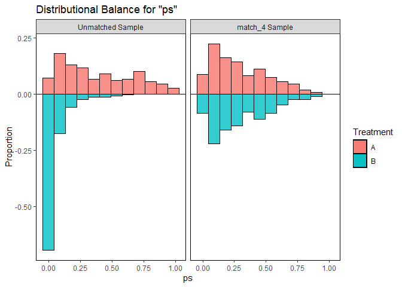<!-- -->

### Using `love.plot` to look at Standardized Differences

``` r
love.plot(bal4, 
          threshold = .1, size = 3,
          var.order = "unadjusted",
          stats = "mean.diffs",
          stars = "raw",
          sample.names = c("Unmatched", "Matched"),
          title = "Love Plot for our 1:1 Caliper Match") +
    labs(caption = "* indicates raw mean differences (for binary variables)")
```

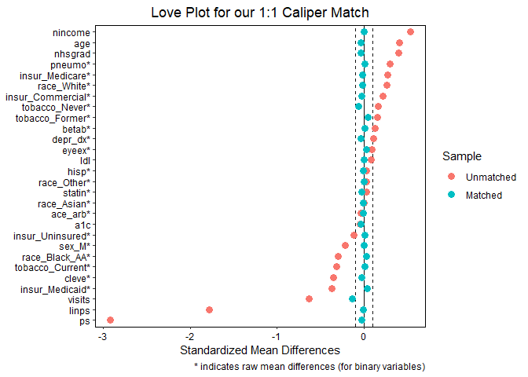<!-- -->

### Using `love.plot` to look at Variance Ratios

Again, the categorical variables are dropped.

``` r
love.plot(bal4, 
          threshold = .5, size = 3,
          stats = "variance.ratios",
          sample.names = c("Unmatched", "Matched"),
          title = "Variance Ratios for our 1:1 Caliper Match") 
```

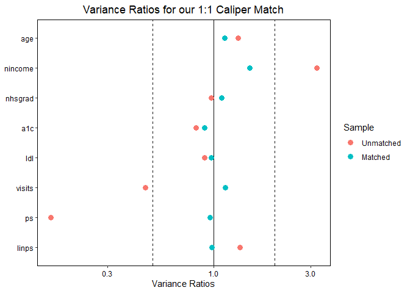<!-- -->

# Planned matches coming as soon as Dr. Love finishes them

  - Nearest Neighbor Matching using the `MatchIt` package
  - Optimal Matching using the `MatchIt` package
  - Full Matching using the `MatchIt` package
  - Genetic Matching using the `MatchIt` package
  - Coarsened Exact Matching using the `MatchIt` package

# Outcome Models

We’ll fit two (overly simplistic) outcome models, one for `bp_good` (our
binary outcome) and another for `bmi` (our quantitative outcome.) Later,
we’ll compare the `exposure` effect estimates made here to the estimates
we obtain after propensity matching. In each case, we’ll focus on ATT
estimates (average treated effect on the treated) rather than ATE
estimates.

## Unadjusted Models prior to Propensity Matching

### Unadjusted Outcome Model for `bp_good`

``` r
unadj_mod1 <- glm(bp_good == 1 ~ exposure == "A", data = dm2200, 
                  family = binomial())

tidy(unadj_mod1, exponentiate = TRUE, 
     conf.int = TRUE, conf.level = 0.95) %>%
    select(term, estimate, std.error, 
           conf.low, conf.high) %>%
    knitr::kable(digits = 3)
```

| term                | estimate | std.error | conf.low | conf.high |
| :------------------ | -------: | --------: | -------: | --------: |
| (Intercept)         |    2.515 |     0.050 |    2.284 |     2.773 |
| exposure == “A”TRUE |    0.561 |     0.152 |    0.417 |     0.757 |

### Unadjusted Outcome Model for `bmi`

``` r
unadj_mod2 <- lm(bmi ~ exposure == "A", data = dm2200)

tidy(unadj_mod2, conf.int = TRUE, conf.level = 0.95) %>%
    select(term, estimate, std.error, 
           conf.low, conf.high) %>%
    knitr::kable(digits = 3)
```

| term                | estimate | std.error | conf.low | conf.high |
| :------------------ | -------: | --------: | -------: | --------: |
| (Intercept)         |   35.087 |     0.183 |   34.729 |    35.446 |
| exposure == “A”TRUE |  \-2.260 |     0.606 |  \-3.449 |   \-1.071 |

## Adjusted Outcome Models after `match1`

### Binary Outcome: `bp_good`

``` r
result_match1_bp <- clogit(bp_good ~ (exposure == "A") + 
                          strata(match1_matches),
                      data = dm2200_matched1)

tidy(result_match1_bp, exponentiate = TRUE, conf.int = TRUE, conf.level = 0.95) %>%
    select(term, estimate, std.error, conf.low, conf.high) %>%
    knitr::kable(digits = 3)
```

| term                | estimate | std.error | conf.low | conf.high |
| :------------------ | -------: | --------: | -------: | --------: |
| exposure == “A”TRUE |    0.583 |     0.213 |    0.384 |     0.885 |

### Quantitative Outcome: `bmi`

We’ll use a mixed model to account for our 1:1 matching. The matches
here are treated as a random factor, with the exposure a fixed factor,
in the `lme4` package.

``` r
dm2200_matched1 <- dm2200_matched1 %>% 
    mutate(match1_matches_f = as.factor(match1_matches))

result_match1_bmi <- lmer(bmi ~ (exposure == "A") + 
                              (1 | match1_matches_f), 
                          data = dm2200_matched1)
```

    boundary (singular) fit: see ?isSingular

``` r
tidy(result_match1_bmi, 
     conf.int = TRUE, conf.level = 0.95) %>% 
    filter(group == "fixed") %>%
    select(term, estimate, std.error, 
           conf.low, conf.high) %>%
    knitr::kable(digits = 3)
```

    Warning in bind_rows_(x, .id): binding factor and character vector, coercing
    into character vector

    Warning in bind_rows_(x, .id): binding character and factor vector, coercing
    into character vector

| term                | estimate | std.error | conf.low | conf.high |
| :------------------ | -------: | --------: | -------: | --------: |
| (Intercept)         |   34.888 |     0.618 |   33.678 |    36.098 |
| exposure == “A”TRUE |  \-2.061 |     0.873 |  \-3.773 |   \-0.349 |

## Adjusted Outcome Models after `match2`

### Binary Outcome: `bp_good`

``` r
result_match2_bp <- clogit(bp_good ~ (exposure == "A") + 
                          strata(match2_matches),
                      data = dm2200_matched2)

tidy(result_match2_bp, exponentiate = TRUE, conf.int = TRUE, conf.level = 0.95) %>%
    select(term, estimate, std.error, conf.low, conf.high) %>%
    knitr::kable(digits = 3)
```

| term                | estimate | std.error | conf.low | conf.high |
| :------------------ | -------: | --------: | -------: | --------: |
| exposure == “A”TRUE |    0.423 |     0.178 |    0.298 |       0.6 |

### Quantitative Outcome: `bmi`

We’ll use a mixed model to account for our 1:1 matching. The matches
here are treated as a random factor, with the exposure a fixed factor,
in the `lme4` package.

``` r
dm2200_matched2 <- dm2200_matched2 %>% 
    mutate(match2_matches_f = as.factor(match2_matches))

result_match2_bmi <- lmer(bmi ~ (exposure == "A") + 
                              (1 | match2_matches_f), 
                          data = dm2200_matched2)

tidy(result_match2_bmi, 
     conf.int = TRUE, conf.level = 0.95) %>% 
    filter(group == "fixed") %>%
    select(term, estimate, std.error, 
           conf.low, conf.high) %>%
    knitr::kable(digits = 3)
```

    Warning in bind_rows_(x, .id): binding factor and character vector, coercing
    into character vector

    Warning in bind_rows_(x, .id): binding character and factor vector, coercing
    into character vector

| term                | estimate | std.error | conf.low | conf.high |
| :------------------ | -------: | --------: | -------: | --------: |
| (Intercept)         |   34.829 |     0.461 |   33.925 |    35.734 |
| exposure == “A”TRUE |  \-2.002 |     0.570 |  \-3.121 |   \-0.884 |

## Adjusted Outcome Models after `match3`

### Binary Outcome: `bp_good`

``` r
result_match3_bp <- clogit(bp_good ~ (exposure == "A") + 
                          strata(match3_matches),
                      data = dm2200_matched3)

tidy(result_match3_bp, exponentiate = TRUE, conf.int = TRUE, conf.level = 0.95) %>%
    select(term, estimate, std.error, conf.low, conf.high) %>%
    knitr::kable(digits = 3)
```

| term                | estimate | std.error | conf.low | conf.high |
| :------------------ | -------: | --------: | -------: | --------: |
| exposure == “A”TRUE |    0.616 |     0.135 |    0.473 |     0.804 |

### Quantitative Outcome: `bmi`

We’ll use a mixed model to account for our 1:1 matching. The matches
here are treated as a random factor, with the exposure a fixed factor,
in the `lme4` package.

``` r
dm2200_matched3 <- dm2200_matched3 %>% 
    mutate(match3_matches_f = as.factor(match3_matches))

result_match3_bmi <- lmer(bmi ~ (exposure == "A") + 
                              (1 | match3_matches_f), 
                          data = dm2200_matched3)

tidy(result_match3_bmi, 
     conf.int = TRUE, conf.level = 0.95) %>% 
    filter(group == "fixed") %>%
    select(term, estimate, std.error, 
           conf.low, conf.high) %>%
    knitr::kable(digits = 3)
```

    Warning in bind_rows_(x, .id): binding factor and character vector, coercing
    into character vector

    Warning in bind_rows_(x, .id): binding character and factor vector, coercing
    into character vector

| term                | estimate | std.error | conf.low | conf.high |
| :------------------ | -------: | --------: | -------: | --------: |
| (Intercept)         |   34.937 |     0.420 |   34.113 |    35.761 |
| exposure == “A”TRUE |  \-2.110 |     0.456 |  \-3.004 |   \-1.216 |

## Adjusted Outcome Models after `match4`

### Binary Outcome: `bp_good`

``` r
result_match4_bp <- clogit(bp_good ~ (exposure == "A") + 
                          strata(match4_matches),
                      data = dm2200_matched4)

tidy(result_match4_bp, exponentiate = TRUE, conf.int = TRUE, conf.level = 0.95) %>%
    select(term, estimate, std.error, conf.low, conf.high) %>%
    knitr::kable(digits = 3)
```

| term                | estimate | std.error | conf.low | conf.high |
| :------------------ | -------: | --------: | -------: | --------: |
| exposure == “A”TRUE |    0.622 |     0.241 |    0.388 |     0.997 |

### Quantitative Outcome: `bmi`

We’ll use a mixed model to account for our 1:1 matching. The matches
here are treated as a random factor, with the exposure a fixed factor,
in the `lme4` package.

``` r
dm2200_matched4 <- dm2200_matched4 %>% 
    mutate(match4_matches_f = as.factor(match4_matches))

result_match4_bmi <- lmer(bmi ~ (exposure == "A") + 
                              (1 | match4_matches_f), 
                          data = dm2200_matched4)
```

    boundary (singular) fit: see ?isSingular

``` r
tidy(result_match4_bmi, 
     conf.int = TRUE, conf.level = 0.95) %>% 
    filter(group == "fixed") %>%
    select(term, estimate, std.error, 
           conf.low, conf.high) %>%
    knitr::kable(digits = 3)
```

    Warning in bind_rows_(x, .id): binding factor and character vector, coercing
    into character vector

    Warning in bind_rows_(x, .id): binding character and factor vector, coercing
    into character vector

| term                | estimate | std.error | conf.low | conf.high |
| :------------------ | -------: | --------: | -------: | --------: |
| (Intercept)         |   34.741 |     0.669 |   33.429 |    36.052 |
| exposure == “A”TRUE |  \-1.490 |     0.946 |  \-3.344 |     0.365 |

# Cleanup

We’ve created a lot of variables here that we don’t actually need going
forward. So I’ll remove them here:

``` r
rm(bal1, bal2, bal3, bal4,
   covs_1, covs_1plus, covs_2plus, covs_3plus, covs_4plus,
   covs_for_rubin, dm2200, 
   dm2200_matched1, dm2200_matched2, dm2200_matched3,
   dm2200_matched4,
   match_1, match_2, match_3, match_4,
   prop_model, 
   result_match1_bmi, result_match2_bmi, result_match3_bmi,
   result_match4_bmi,
   result_match1_bp, result_match2_bp, result_match3_bp,
   result_match4_bp,
   rubin_m1, rubin_m2, rubin_m3,
   rubin_report_m1, rubin_report_m12, rubin_report_m123,
   rubin_report_m1234,
   t1, unadj_mod1, unadj_mod2,
   match1_matches, match2_matches, match3_matches)
```

# Key References

Matching in these examples was performed using the Matching package
(Sekhon, 2011), and covariate balance was assessed using cobalt
(Greifer, 2020), both in R (R Core Team, 2019).

  - Greifer, N. (2020). cobalt: Covariate Balance Tables and Plots. R
    package version 4.0.0.
  - Sekhon, J.S. (2011) Multivariate and Propensity Score Matching
    Software with Automated Balance Optimization: The Matching Package
    for R, *J of Statistical Software*, 2011, 42: 7,
    <http://www.jstatsoft.org/>. R package version 4.9-6.
  - R Core Team (2019). R: A language and environment for statistical
    computing. R Foundation for Statistical Computing, Vienna, Austria.
    URL <https://www.R-project.org/>.
