The Lindner Example
================
Harry A. Persaud
Version: 2020-01-27

  - [Loading data](#loading-data)
  - [Data managment](#data-managment)
      - [Managing binary variables](#managing-binary-variables)
      - [Inspecting the clean data](#inspecting-the-clean-data)
  - [Codebook](#codebook)
  - [Table 1](#table-1)
  - [Task 1: Ignoring covariates, estimate the effect of treatment
    vs. control on the two
    outcomes](#task-1-ignoring-covariates-estimate-the-effect-of-treatment-vs.-control-on-the-two-outcomes)
      - [Quantitative outcome:
        `cardbill`](#quantitative-outcome-cardbill)
      - [Binary outcome:
        `sixMonthSurvive`](#binary-outcome-sixmonthsurvive)
  - [Task 2: Fitting the propensity score
    model](#task-2-fitting-the-propensity-score-model)
      - [Comparing distribution of propensity scores across treatment
        groups](#comparing-distribution-of-propensity-scores-across-treatment-groups)
      - [Numerically](#numerically)
      - [Visually](#visually)
          - [Boxplot](#boxplot)
          - [Density plot](#density-plot)
  - [Task 3: Rubin’s Rules For Assessing Overlap Before Propensity
    Adjustment](#task-3-rubins-rules-for-assessing-overlap-before-propensity-adjustment)
      - [Rubin’s Rule 1](#rubins-rule-1)
      - [Rubin’s Rule 2](#rubins-rule-2)
  - [Task 4: Greedy 1:1 matching on the linear
    PS](#task-4-greedy-11-matching-on-the-linear-ps)
      - [Love Plot of standardized differences before and after 1:1
        matching](#love-plot-of-standardized-differences-before-and-after-11-matching)
      - [Using ggplot](#using-ggplot)
      - [Using `cobalt` to make the Love
        Plot](#using-cobalt-to-make-the-love-plot)
      - [Extracting Variance Ratios](#extracting-variance-ratios)
      - [Creating a dataframe containing the matched
        sample](#creating-a-dataframe-containing-the-matched-sample)
      - [Reassessing Rubin’s Rules after 1:1 matching without
        replacement](#reassessing-rubins-rules-after-11-matching-without-replacement)
          - [Rubin’s Rule 1](#rubins-rule-1-1)
          - [Rubin’s Rule 2](#rubins-rule-2-1)
  - [Task 5: Estimating the causal effect of the treatment on both
    outcomes after 1:1 matching without
    replacement](#task-5-estimating-the-causal-effect-of-the-treatment-on-both-outcomes-after-11-matching-without-replacement)
      - [The Quantitative outcome](#the-quantitative-outcome)
      - [The binary outcome](#the-binary-outcome)
  - [Task 6 1:1 Matching With
    replacement](#task-6-11-matching-with-replacement)
      - [Love Plot of standardized differences before and after 1:1
        matching](#love-plot-of-standardized-differences-before-and-after-11-matching-1)
      - [Using ggplot](#using-ggplot-1)
      - [Using `cobalt` to make the Love
        Plot](#using-cobalt-to-make-the-love-plot-1)
      - [Extracting Variance Ratios](#extracting-variance-ratios-1)
      - [Creating a dataframe containing the matched
        sample](#creating-a-dataframe-containing-the-matched-sample-1)
      - [Reassessing Rubin’s Rules after 1:1 matching with
        replacement](#reassessing-rubins-rules-after-11-matching-with-replacement)
          - [Rubin’s Rule 1](#rubins-rule-1-2)
          - [Rubin’s Rule 2](#rubins-rule-2-2)
      - [Estimating the causal effect of the treatment on both outcomes
        after 1:1 matching with
        replacement](#estimating-the-causal-effect-of-the-treatment-on-both-outcomes-after-11-matching-with-replacement)
          - [The Quantitative outcome](#the-quantitative-outcome-1)
          - [The binary outcome](#the-binary-outcome-1)
  - [Task 7: Subclassification by PS
    quintile](#task-7-subclassification-by-ps-quintile)
      - [Check Balance and Propensity Score Overlap in Each
        Quintile](#check-balance-and-propensity-score-overlap-in-each-quintile)
          - [Numerically](#numerically-1)
          - [Graphically](#graphically)
      - [Creating a Standardized Difference Calculation
        Function](#creating-a-standardized-difference-calculation-function)
      - [Plotting the post-subclassification standardized
        differences](#plotting-the-post-subclassification-standardized-differences)
      - [Rubin’s Rules post
        subclassification](#rubins-rules-post-subclassification)
          - [Rule 1](#rule-1)
          - [Rule 2](#rule-2)
  - [Task 8: Estimated effect after
    subclassification](#task-8-estimated-effect-after-subclassification)
      - [Quantitative outcome](#quantitative-outcome)
      - [Binary Outcome](#binary-outcome)
  - [Task 9: Weighting](#task-9-weighting)
      - [Calculating the ATT and ATE
        weights](#calculating-the-att-and-ate-weights)
          - [ATT weights](#att-weights)
          - [ATE weights](#ate-weights)
      - [Working with the ATT weights](#working-with-the-att-weights)
          - [Rubin’s Rules](#rubins-rules)
          - [Estimated effect on outcomes after ATT
            weighting](#estimated-effect-on-outcomes-after-att-weighting)
      - [Working with the ATE weights](#working-with-the-ate-weights)
          - [Rubin’s Rules](#rubins-rules-1)
          - [Estimated effect on outcomes after ATE
            weighting](#estimated-effect-on-outcomes-after-ate-weighting)
  - [Task 10: Using TWANG for PS estimation and ATT
    weighting](#task-10-using-twang-for-ps-estimation-and-att-weighting)
      - [Estimated effect on outcomes after TWANG ATT
        weighting](#estimated-effect-on-outcomes-after-twang-att-weighting)
          - [Quantitative outcome](#quantitative-outcome-3)
          - [Binary outcome](#binary-outcome-3)
  - [Task 11: After direct adjustment with linear
    PS](#task-11-after-direct-adjustment-with-linear-ps)
      - [Quantitative outcome](#quantitative-outcome-4)
      - [Binary outcome](#binary-outcome-4)
  - [Task 12: “Double Robust” Approach: Weighting + Direct
    Adjustment](#task-12-double-robust-approach-weighting-direct-adjustment)
      - [Quantitative outcome](#quantitative-outcome-5)
          - [ATT weights](#att-weights-1)
          - [ATE weights](#ate-weights-1)
          - [TWANG ATT weights](#twang-att-weights)
      - [Binary outcome](#binary-outcome-5)
          - [ATT weights](#att-weights-2)
          - [ATE weights](#ate-weights-2)
          - [TWANG ATT weights](#twang-att-weights-1)

``` r
# Load packages
library(broom)
library(patchwork)
library(cobalt)
library(Matching)
library(tableone)
library(twang)
library(janitor)
library(here)
library(magrittr)
library(lme4)
library(tidyverse)
```

# Loading data

Information on the lindner dataset can be found
[here](https://www.rdocumentation.org/packages/MatchLinReg/versions/0.7.0/topics/lindner)
<sup>1,2</sup>

<sup>1</sup> Rdocumentation. (n.d.). lindner: Lindner Center Data On 996
PCI Patients Analyzed By Kereiakes Et Al. (2000). Retrieved from
<https://www.rdocumentation.org/packages/MatchLinReg/versions/0.7.0/topics/lindner>

<sup>2</sup> Kereiakes DJ, Obenchain RL, Barber BL, et al. Abciximab
provides cost effective survival advantage in high volume interventional
practice. Am Heart J 2000; 140: 603-610.

``` r
#Read in data using 'here' package
lindner_raw <- read.csv(here("data", "lindner.csv")) %>% 
  tbl_df()

#print first 10 rows of data frame
lindner_raw
```

    ## # A tibble: 996 x 11
    ##    lifepres cardbill abcix stent height female diabetic acutemi ejecfrac
    ##       <dbl>    <int> <int> <int>  <int>  <int>    <int>   <int>    <int>
    ##  1      0      14301     1     0    163      1        1       0       56
    ##  2     11.6     3563     1     0    168      0        0       0       56
    ##  3     11.6     4694     1     0    188      0        0       0       50
    ##  4     11.6     7366     1     0    175      0        1       0       50
    ##  5     11.6     8247     1     0    168      1        0       0       55
    ##  6     11.6     8319     1     0    178      0        0       0       50
    ##  7     11.6     8410     1     0    185      0        0       0       58
    ##  8     11.6     8517     1     0    173      1        0       0       30
    ##  9     11.6     8763     1     0    152      1        0       0       60
    ## 10     11.6     8823     1     0    180      0        0       0       60
    ## # ... with 986 more rows, and 2 more variables: ves1proc <int>,
    ## #   sixMonthSurvive <lgl>

  - The dataset contains information on 996 participants.

<!-- end list -->

``` r
# see how much missing data is in dataset (none)
colSums(is.na(lindner_raw))
```

    ##        lifepres        cardbill           abcix           stent          height 
    ##               0               0               0               0               0 
    ##          female        diabetic         acutemi        ejecfrac        ves1proc 
    ##               0               0               0               0               0 
    ## sixMonthSurvive 
    ##               0

  - There is no missing data.

# Data managment

## Managing binary variables

We’ll want both a numeric and factored version of each binary variable.

  - In all numeric versions of binary variables: 1 indicates ‘yes’ to
    having trait/characteristic, 0 indicates ‘no’ to having
    trait/characteristic.

  - variable names with trailing "\_f" denotes the factored version of
    each binary variable.

<!-- end list -->

``` r
# Six month survival (turning logical variable to a factor)
lindner_raw$sixMonthSurvive_f <- factor(lindner_raw$sixMonthSurvive, levels = c(TRUE,FALSE),
labels = c("yes", "no"))

# Creating numeric (1/0) version of six month survival variable
lindner_raw$sixMonthSurvive <- factor(lindner_raw$sixMonthSurvive_f, levels = c("yes","no"),
labels = c(1, 0))

lindner_raw$sixMonthSurvive <- ifelse(lindner_raw$sixMonthSurvive == "1", 1, 0)

#Add variable named treated (same values as abcix variable)
lindner_raw$treated <- lindner_raw$abcix

# Factoring the exposure of interest variable. Change the name to 'treated' too.
lindner_raw$treated_f <- factor(lindner_raw$abcix, levels = c(1,0),
labels = c("treated", "control"))

# Factor version of stent variable
lindner_raw$stent_f <- factor(lindner_raw$stent, levels = c(1,0),
labels = c("yes", "no"))

# Factoring the female variable
lindner_raw$female_f <- factor(lindner_raw$female, levels = c(1,0),
labels = c("female", "male"))

# Factoring the diabetic variable
lindner_raw$diabetic_f <- factor(lindner_raw$diabetic, levels = c(1,0),
labels = c("yes", "no"))

# Factoring the acutemi variable
lindner_raw$acutemi_f <- factor(lindner_raw$acutemi, levels = c(1,0),
labels = c("yes", "no"))

#make lindner dataset with "clean" name. 
lindner_clean <- lindner_raw
```

## Inspecting the clean data

``` r
mosaic::inspect(lindner_clean)
```

    ## Registered S3 method overwritten by 'mosaic':
    ##   method                           from   
    ##   fortify.SpatialPolygonsDataFrame ggplot2

    ## 
    ## categorical variables:  
    ##                name  class levels   n missing
    ## 1 sixMonthSurvive_f factor      2 996       0
    ## 2         treated_f factor      2 996       0
    ## 3           stent_f factor      2 996       0
    ## 4          female_f factor      2 996       0
    ## 5        diabetic_f factor      2 996       0
    ## 6         acutemi_f factor      2 996       0
    ##                                    distribution
    ## 1 yes (97.4%), no (2.6%)                       
    ## 2 treated (70.1%), control (29.9%)             
    ## 3 yes (66.9%), no (33.1%)                      
    ## 4 male (65.3%), female (34.7%)                 
    ## 5 no (77.6%), yes (22.4%)                      
    ## 6 no (85.6%), yes (14.4%)                      
    ## 
    ## quantitative variables:  
    ##               name   class  min       Q1  median      Q3      max         mean
    ## 1         lifepres numeric    0    11.60    11.6    11.6     11.6 1.129719e+01
    ## 2         cardbill integer 2216 10218.75 12458.0 16660.0 178534.0 1.567416e+04
    ## 3            abcix integer    0     0.00     1.0     1.0      1.0 7.008032e-01
    ## 4            stent integer    0     0.00     1.0     1.0      1.0 6.686747e-01
    ## 5           height integer  108   165.00   173.0   178.0    196.0 1.714438e+02
    ## 6           female integer    0     0.00     0.0     1.0      1.0 3.473896e-01
    ## 7         diabetic integer    0     0.00     0.0     0.0      1.0 2.238956e-01
    ## 8          acutemi integer    0     0.00     0.0     0.0      1.0 1.435743e-01
    ## 9         ejecfrac integer    0    45.00    55.0    56.0     90.0 5.096687e+01
    ## 10        ves1proc integer    0     1.00     1.0     2.0      5.0 1.385542e+00
    ## 11 sixMonthSurvive numeric    0     1.00     1.0     1.0      1.0 9.738956e-01
    ## 12         treated integer    0     0.00     1.0     1.0      1.0 7.008032e-01
    ##              sd   n missing
    ## 1  1.850501e+00 996       0
    ## 2  1.118226e+04 996       0
    ## 3  4.581362e-01 996       0
    ## 4  4.709262e-01 996       0
    ## 5  1.065813e+01 996       0
    ## 6  4.763800e-01 996       0
    ## 7  4.170623e-01 996       0
    ## 8  3.508337e-01 996       0
    ## 9  1.041326e+01 996       0
    ## 10 6.573525e-01 996       0
    ## 11 1.595259e-01 996       0
    ## 12 4.581362e-01 996       0

# Codebook

Information was copy/pasted from
[here](https://www.rdocumentation.org/packages/MatchLinReg/versions/0.7.0/topics/lindner)
<sup>1,2</sup> (with some changes to reflect this analysis)

  - `cardbill` (**Quantitative OUTCOME**): “Cardiac related costs
    incurred within 6 months of patient’s initial PCI; numeric value in
    1998 dollars; costs were truncated by death for the 26 patients with
    lifepres == 0.”

  - `sixMonthSurvive`/`sixMonthSurvive_f` (**BINARY OUTCOME**):
    “Survival at six months a recoded version of lifepres.”

  - `treated`/`treated_f` (**EXPOSURE**): “Numeric treatment selection
    indicator; 0 implies usual PCI care alone; 1 implies usual PCI care
    deliberately augmented by either planned or rescue treatment with
    abciximab.”

  - `stent`/`stent_f`: “Coronary stent deployment; numeric, with 1
    meaning YES and 0 meaning NO.”

  - `height`: “Height in centimeters; numeric integer from 108 to 196.”

  - `female`/`female_f`: “Female gender; numeric, with 1 meaning YES and
    0 meaning NO.”

  - `diabetic`/`diabetic_f`: “Diabetes mellitus diagnosis; numeric, with
    1 meaning YES and 0 meaning NO.”

  - `acutemi`/`acutemi_f`: “Acute myocardial infarction within the
    previous 7 days; numeric, with 1 meaning YES and 0 meaning NO.”

  - `ejecfrac`: “Left ejection fraction; numeric value from 0 percent to
    90 percent.”

  - `ves1proc`: “Number of vessels involved in the patient’s initial PCI
    procedure; numeric integer from 0 to 5.”

  - Note: Percutaneous Coronary Intervention (PCI)

<sup>1</sup> Rdocumentation. (n.d.). lindner: Lindner Center Data On 996
PCI Patients Analyzed By Kereiakes Et Al. (2000). Retrieved from
<https://www.rdocumentation.org/packages/MatchLinReg/versions/0.7.0/topics/lindner>

<sup>2</sup> Kereiakes DJ, Obenchain RL, Barber BL, et al. Abciximab
provides cost effective survival advantage in high volume interventional
practice. Am Heart J 2000; 140: 603-610.

# Table 1

``` r
#List of variable namees 
var_list = c("cardbill", "sixMonthSurvive_f", "stent_f", "height", "female_f", "diabetic_f", "acutemi_f", "ejecfrac", "ves1proc")

#list factor variables
factor_list = c("sixMonthSurvive_f", "stent_f", "female_f", "diabetic_f", "acutemi_f")

CreateTableOne(vars = var_list, strata = "treated_f",
data = lindner_clean, factorVars = factor_list)
```

    ##                             Stratified by treated_f
    ##                              treated            control             p      test
    ##   n                               698                298                       
    ##   cardbill (mean (SD))       16126.68 (9383.83) 14614.22 (14514.00)  0.051     
    ##   sixMonthSurvive_f = no (%)       11 ( 1.6)          15 ( 5.0)      0.004     
    ##   stent_f = no (%)                206 (29.5)         124 (41.6)     <0.001     
    ##   height (mean (SD))           171.44 (10.69)     171.45 (10.59)     0.996     
    ##   female_f = male (%)             467 (66.9)         183 (61.4)      0.111     
    ##   diabetic_f = no (%)             555 (79.5)         218 (73.2)      0.034     
    ##   acutemi_f = no (%)              573 (82.1)         280 (94.0)     <0.001     
    ##   ejecfrac (mean (SD))          50.40 (10.42)      52.29 (10.30)     0.009     
    ##   ves1proc (mean (SD))           1.46 (0.71)        1.20 (0.48)     <0.001

The mean `cardbill` was higher in the treated population. A larger
percentage of controls did not survive through 6 months.

# Task 1: Ignoring covariates, estimate the effect of treatment vs. control on the two outcomes

## Quantitative outcome: `cardbill`

``` r
#summary stats on quantitative outcome
lindner_clean %$%
  mosaic::favstats(cardbill ~ treated_f)
```

    ##   treated_f  min       Q1 median       Q3    max     mean        sd   n missing
    ## 1   treated 3563 10902.25  12944 17080.75  96741 16126.68  9383.825 698       0
    ## 2   control 2216  8300.00  10423 15895.75 178534 14614.22 14513.996 298       0

  - Across the entire sample, the mean ($16,127 vs. $14,614) and median
    ($12,944 vs. $10,423) cardiac care costs were higher in treated
    individuals than non-treated participants.

<!-- end list -->

``` r
#Histogram using ggplot
ggplot(lindner_clean, aes(x = cardbill, fill = "cardbill")) +
  geom_histogram() +
  theme_bw() +
  labs(y = "Count",
       x = "Cardiac care costs ($)",
       title = "Cardbill appears to be right skewed") +
  guides(fill = FALSE)
```

    ## `stat_bin()` using `bins = 30`. Pick better value with `binwidth`.

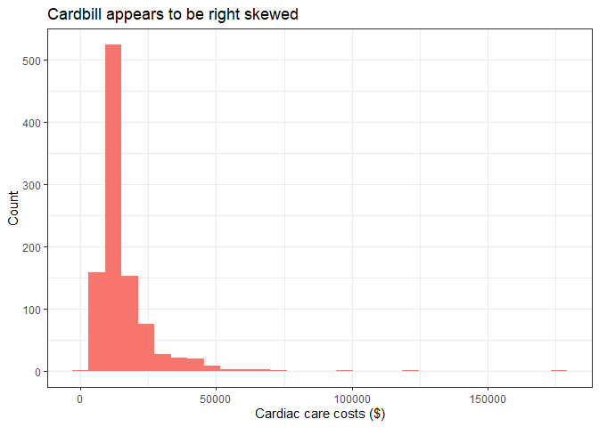<!-- -->

`cardbill` appears to be right/positively skewed.

``` r
#Build model
unadjust_quant_outcome <- lm(cardbill ~ treated, data = lindner_clean)

# Store model information in tidied dataframe
unadjust_quant_outcome_tidy <- tidy(unadjust_quant_outcome, conf.int = TRUE, conf.level = 0.95) %>%
    filter(term == "treated")

unadjust_quant_outcome_tidy
```

    ## # A tibble: 1 x 7
    ##   term    estimate std.error statistic p.value conf.low conf.high
    ##   <chr>      <dbl>     <dbl>     <dbl>   <dbl>    <dbl>     <dbl>
    ## 1 treated    1512.      773.      1.96  0.0506    -3.83     3029.

Treated individuals were estimated to spend 1512.46 (95%CI -3.83,
3028.76) more dollars than non-treated individuals.

## Binary outcome: `sixMonthSurvive`

``` r
#contingency table using EPI package
Epi::twoby2(table(lindner_clean$treated_f, lindner_clean$sixMonthSurvive_f))
```

    ## 2 by 2 table analysis: 
    ## ------------------------------------------------------ 
    ## Outcome   : yes 
    ## Comparing : treated vs. control 
    ## 
    ##         yes no    P(yes) 95% conf. interval
    ## treated 687 11    0.9842    0.9718   0.9913
    ## control 283 15    0.9497    0.9182   0.9694
    ## 
    ##                                    95% conf. interval
    ##              Relative Risk: 1.0364    1.0080   1.0656
    ##          Sample Odds Ratio: 3.3103    1.5020   7.2957
    ## Conditional MLE Odds Ratio: 3.3057    1.3992   8.0624
    ##     Probability difference: 0.0346    0.0115   0.0664
    ## 
    ##              Exact P-value: 0.0037 
    ##         Asymptotic P-value: 0.0030 
    ## ------------------------------------------------------

The odds treated individuals were alive after 6 months was roughly 3.31
times the odds that non-treated individuals were alive after 6 months.

``` r
#Logistic regression modeel
unadjust_binary_outcome <- glm(sixMonthSurvive ~ treated, data = lindner_clean, family = binomial())

# Store model information in tidied dataframe
unadjust_binary_outcome_tidy <- tidy(unadjust_binary_outcome, conf.int = TRUE, conf.level = 0.95, exponentiate = TRUE) %>%
    filter(term == "treated")

unadjust_binary_outcome_tidy
```

    ## # A tibble: 1 x 7
    ##   term    estimate std.error statistic p.value conf.low conf.high
    ##   <chr>      <dbl>     <dbl>     <dbl>   <dbl>    <dbl>     <dbl>
    ## 1 treated     3.31     0.403      2.97 0.00299     1.51      7.48

The predicted odds of being alive after six months in treated
individuals was 3.31 times higher than the odds that a non-treated
individual would be alive after six months (95%CI 1.51, 7.48).

# Task 2: Fitting the propensity score model

Predict treatment status based on available covariates. We’re not
worried about overfitting (including too many covariates) when
calculating the propensity scores.

``` r
#Use logistic regression to predict log odds of being treated based on available covariates. 
psmodel <- glm(treated ~ stent + height + female + diabetic + acutemi + ejecfrac + ves1proc, family = binomial(), data =lindner_clean)

summary(psmodel)
```

    ## 
    ## Call:
    ## glm(formula = treated ~ stent + height + female + diabetic + 
    ##     acutemi + ejecfrac + ves1proc, family = binomial(), data = lindner_clean)
    ## 
    ## Deviance Residuals: 
    ##     Min       1Q   Median       3Q      Max  
    ## -2.5211  -1.2109   0.6399   0.8827   1.5259  
    ## 
    ## Coefficients:
    ##              Estimate Std. Error z value Pr(>|z|)    
    ## (Intercept)  2.965651   1.731085   1.713  0.08668 .  
    ## stent        0.573018   0.150454   3.809  0.00014 ***
    ## height      -0.015366   0.009534  -1.612  0.10700    
    ## female      -0.359060   0.206904  -1.735  0.08267 .  
    ## diabetic    -0.406810   0.170623  -2.384  0.01711 *  
    ## acutemi      1.199548   0.270468   4.435 9.20e-06 ***
    ## ejecfrac    -0.014789   0.007403  -1.998  0.04574 *  
    ## ves1proc     0.760502   0.138437   5.493 3.94e-08 ***
    ## ---
    ## Signif. codes:  0 '***' 0.001 '**' 0.01 '*' 0.05 '.' 0.1 ' ' 1
    ## 
    ## (Dispersion parameter for binomial family taken to be 1)
    ## 
    ##     Null deviance: 1215.5  on 995  degrees of freedom
    ## Residual deviance: 1124.3  on 988  degrees of freedom
    ## AIC: 1140.3
    ## 
    ## Number of Fisher Scoring iterations: 4

Store the raw and linear propensity scores below.

``` r
lindner_clean$ps <- psmodel$fitted
lindner_clean$linps <- psmodel$linear.predictors
```

## Comparing distribution of propensity scores across treatment groups

## Numerically

``` r
lindner_clean %$% 
  mosaic::favstats(ps ~ treated_f)
```

    ##   treated_f       min        Q1    median        Q3       max      mean
    ## 1   treated 0.3121753 0.6402644 0.7158289 0.8259514 0.9800181 0.7265015
    ## 2   control 0.2323431 0.5558665 0.6462761 0.7093624 0.9583296 0.6406106
    ##          sd   n missing
    ## 1 0.1299570 698       0
    ## 2 0.1230138 298       0

Above we can see there are no propensity scores equal to, or very close
to, 0 or 1.

## Visually

### Boxplot

Now we’ll visualize the distribution of the propensity scores stratified
by treatment status.

``` r
ggplot(lindner_clean, aes(x = treated_f, y = ps, color = treated_f)) +
geom_boxplot() +
geom_jitter(width = 0.1) +
guides(color = FALSE) +
theme_bw() +
labs(x = "",
     title = "Raw propensity scores, stratified by exposure group")
```

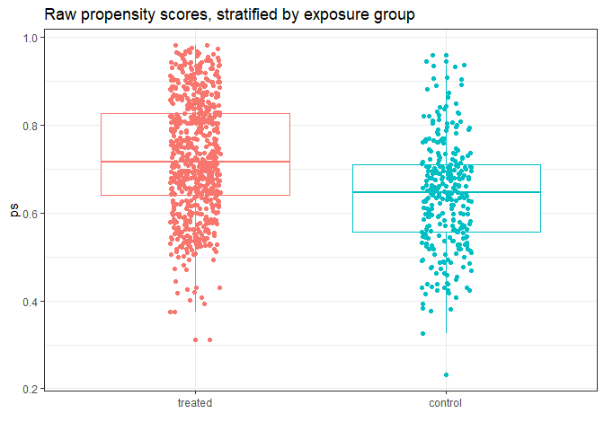<!-- -->

### Density plot

``` r
ggplot(lindner_clean, aes(x = linps, fill = treated_f)) +
geom_density(alpha = 0.3) +
  theme_bw()
```

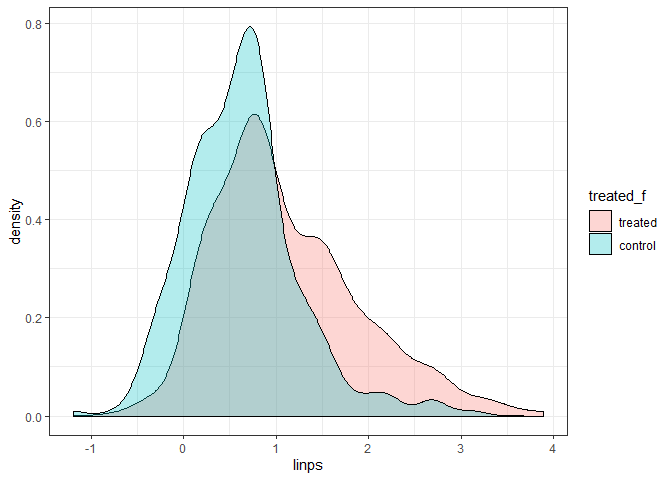<!-- -->

Both plots demonstrate good overlap, suggesting a propensity score
analysis may be appropriate.

# Task 3: Rubin’s Rules For Assessing Overlap Before Propensity Adjustment

## Rubin’s Rule 1

``` r
rubin1.unadj <- with(lindner_clean,
abs(100*(mean(linps[treated==1])-mean(linps[treated==0]))/sd(linps)))
rubin1.unadj
```

    ## [1] 61.86668

Fail Rubin’s Rule 1 (want a value below 50%).

## Rubin’s Rule 2

``` r
rubin2.unadj <-with(lindner_clean, var(linps[treated==1])/var(linps[treated==0]))
rubin2.unadj
```

    ## [1] 1.672048

Fail Rubin’s Rule 2 (looking for value between 0.8 - 1.2 \[ideally, 1\])

# Task 4: Greedy 1:1 matching on the linear PS

  - Without replacement

  - Match 1 treated patient to 1 control patient (so we’ll have “left
    over” treated patients not included in the sample)

<!-- end list -->

``` r
X <- lindner_clean$linps ## matching on the linear propensity score
Tr <- as.logical(lindner_clean$treated)
match1 <- Match(Tr=Tr, X=X, M = 1, replace=FALSE, ties=FALSE)
```

    ## Warning in Match(Tr = Tr, X = X, M = 1, replace = FALSE, ties = FALSE):
    ## replace==FALSE, but there are more (weighted) treated obs than control obs. Some
    ## treated obs will not be matched. You may want to estimate ATC instead.

``` r
summary(match1)
```

    ## 
    ## Estimate...  0 
    ## SE.........  0 
    ## T-stat.....  NaN 
    ## p.val......  NA 
    ## 
    ## Original number of observations..............  996 
    ## Original number of treated obs...............  698 
    ## Matched number of observations...............  298 
    ## Matched number of observations  (unweighted).  298

Matched 298 treated individuals with 298 control participants.

  - Note: all controls are used in this sample. However, only 298/698
    treated individuals were used.

Below we’ll assess the match balance from the 1:1 matching.

``` r
set.seed(2020)
mb1 <- MatchBalance(treated ~ stent + height + female + diabetic + acutemi + ejecfrac + ves1proc + ps + linps, data=lindner_clean,
match.out = match1, nboots=500)
```

    ## 
    ## ***** (V1) stent *****
    ##                        Before Matching        After Matching
    ## mean treatment........    0.70487            0.60738 
    ## mean control..........    0.58389            0.58389 
    ## std mean diff.........     26.505             4.8022 
    ## 
    ## mean raw eQQ diff.....    0.12081            0.02349 
    ## med  raw eQQ diff.....          0                  0 
    ## max  raw eQQ diff.....          1                  1 
    ## 
    ## mean eCDF diff........   0.060489           0.011745 
    ## med  eCDF diff........   0.060489           0.011745 
    ## max  eCDF diff........    0.12098            0.02349 
    ## 
    ## var ratio (Tr/Co).....    0.85457            0.98151 
    ## T-test p-value........ 0.00032255            0.49472 
    ## 
    ## 
    ## ***** (V2) height *****
    ##                        Before Matching        After Matching
    ## mean treatment........     171.44             171.77 
    ## mean control..........     171.45             171.45 
    ## std mean diff.........  -0.033804             3.1486 
    ## 
    ## mean raw eQQ diff.....    0.56376            0.88591 
    ## med  raw eQQ diff.....          0                  0 
    ## max  raw eQQ diff.....         20                 36 
    ## 
    ## mean eCDF diff........  0.0078996           0.013639 
    ## med  eCDF diff........  0.0060095           0.010067 
    ## max  eCDF diff........   0.024971           0.053691 
    ## 
    ## var ratio (Tr/Co).....     1.0201            0.93356 
    ## T-test p-value........    0.99608            0.70481 
    ## KS Bootstrap p-value..      0.968               0.52 
    ## KS Naive p-value......    0.99947            0.78362 
    ## KS Statistic..........   0.024971           0.053691 
    ## 
    ## 
    ## ***** (V3) female *****
    ##                        Before Matching        After Matching
    ## mean treatment........    0.33095            0.37584 
    ## mean control..........    0.38591            0.38591 
    ## std mean diff.........    -11.672             -2.075 
    ## 
    ## mean raw eQQ diff.....   0.053691           0.010067 
    ## med  raw eQQ diff.....          0                  0 
    ## max  raw eQQ diff.....          1                  1 
    ## 
    ## mean eCDF diff........    0.02748          0.0050336 
    ## med  eCDF diff........    0.02748          0.0050336 
    ## max  eCDF diff........    0.05496           0.010067 
    ## 
    ## var ratio (Tr/Co).....    0.93253            0.98988 
    ## T-test p-value........    0.10045            0.79339 
    ## 
    ## 
    ## ***** (V4) diabetic *****
    ##                        Before Matching        After Matching
    ## mean treatment........    0.20487            0.25503 
    ## mean control..........    0.26846            0.26846 
    ## std mean diff.........    -15.743            -3.0743 
    ## 
    ## mean raw eQQ diff.....   0.063758           0.013423 
    ## med  raw eQQ diff.....          0                  0 
    ## max  raw eQQ diff.....          1                  1 
    ## 
    ## mean eCDF diff........   0.031793          0.0067114 
    ## med  eCDF diff........   0.031793          0.0067114 
    ## max  eCDF diff........   0.063585           0.013423 
    ## 
    ## var ratio (Tr/Co).....    0.82788            0.96743 
    ## T-test p-value........    0.03402            0.68937 
    ## 
    ## 
    ## ***** (V5) acutemi *****
    ##                        Before Matching        After Matching
    ## mean treatment........    0.17908          0.0033557 
    ## mean control..........   0.060403           0.060403 
    ## std mean diff.........     30.931            -98.478 
    ## 
    ## mean raw eQQ diff.....    0.11745           0.057047 
    ## med  raw eQQ diff.....          0                  0 
    ## max  raw eQQ diff.....          1                  1 
    ## 
    ## mean eCDF diff........    0.05934           0.028523 
    ## med  eCDF diff........    0.05934           0.028523 
    ## max  eCDF diff........    0.11868           0.057047 
    ## 
    ## var ratio (Tr/Co).....     2.5853           0.058929 
    ## T-test p-value........ 4.6617e-09          7.888e-05 
    ## 
    ## 
    ## ***** (V6) ejecfrac *****
    ##                        Before Matching        After Matching
    ## mean treatment........     50.403             53.349 
    ## mean control..........     52.289             52.289 
    ## std mean diff.........    -18.102             13.166 
    ## 
    ## mean raw eQQ diff.....     2.0503             1.8255 
    ## med  raw eQQ diff.....          1                  0 
    ## max  raw eQQ diff.....         20                 20 
    ## 
    ## mean eCDF diff........   0.035602           0.026577 
    ## med  eCDF diff........   0.011423           0.033557 
    ## max  eCDF diff........    0.11383           0.053691 
    ## 
    ## var ratio (Tr/Co).....     1.0238            0.61178 
    ## T-test p-value........  0.0085806            0.15945 
    ## KS Bootstrap p-value..      0.002              0.426 
    ## KS Naive p-value......  0.0089219            0.78362 
    ## KS Statistic..........    0.11383           0.053691 
    ## 
    ## 
    ## ***** (V7) ves1proc *****
    ##                        Before Matching        After Matching
    ## mean treatment........     1.4628             1.0403 
    ## mean control..........     1.2047             1.2047 
    ## std mean diff.........     36.545            -67.707 
    ## 
    ## mean raw eQQ diff.....     0.2651            0.16443 
    ## med  raw eQQ diff.....          0                  0 
    ## max  raw eQQ diff.....          1                  2 
    ## 
    ## mean eCDF diff........   0.043323           0.032886 
    ## med  eCDF diff........  0.0090671          0.0067114 
    ## max  eCDF diff........    0.18842            0.13087 
    ## 
    ## var ratio (Tr/Co).....     2.1614            0.25567 
    ## T-test p-value........   4.21e-11         5.2489e-08 
    ## KS Bootstrap p-value.. < 2.22e-16         < 2.22e-16 
    ## KS Naive p-value...... 7.2635e-07           0.012144 
    ## KS Statistic..........    0.18842            0.13087 
    ## 
    ## 
    ## ***** (V8) ps *****
    ##                        Before Matching        After Matching
    ## mean treatment........     0.7265            0.60662 
    ## mean control..........    0.64061            0.64061 
    ## std mean diff.........     66.092            -45.866 
    ## 
    ## mean raw eQQ diff.....   0.085216           0.046911 
    ## med  raw eQQ diff.....   0.081353           0.035726 
    ## max  raw eQQ diff.....    0.12087            0.23215 
    ## 
    ## mean eCDF diff........    0.17141            0.10312 
    ## med  eCDF diff........    0.17768           0.083893 
    ## max  eCDF diff........    0.27599            0.23154 
    ## 
    ## var ratio (Tr/Co).....     1.1161            0.36304 
    ## T-test p-value........ < 2.22e-16          4.559e-12 
    ## KS Bootstrap p-value.. < 2.22e-16         < 2.22e-16 
    ## KS Naive p-value......  3.042e-14         2.3042e-07 
    ## KS Statistic..........    0.27599            0.23154 
    ## 
    ## 
    ## ***** (V9) linps *****
    ##                        Before Matching        After Matching
    ## mean treatment........     1.1148            0.44175 
    ## mean control..........    0.63332            0.63332 
    ## std mean diff.........     60.484            -61.383 
    ## 
    ## mean raw eQQ diff.....     0.4787             0.2442 
    ## med  raw eQQ diff.....    0.35992            0.15424 
    ## max  raw eQQ diff.....     1.0113             2.1601 
    ## 
    ## mean eCDF diff........    0.17141            0.10312 
    ## med  eCDF diff........    0.17768           0.083893 
    ## max  eCDF diff........    0.27599            0.23154 
    ## 
    ## var ratio (Tr/Co).....      1.672            0.25702 
    ## T-test p-value........ < 2.22e-16         6.4793e-13 
    ## KS Bootstrap p-value.. < 2.22e-16         < 2.22e-16 
    ## KS Naive p-value......  3.042e-14         2.3042e-07 
    ## KS Statistic..........    0.27599            0.23154 
    ## 
    ## 
    ## Before Matching Minimum p.value: < 2.22e-16 
    ## Variable Name(s): ves1proc ps linps  Number(s): 7 8 9 
    ## 
    ## After Matching Minimum p.value: < 2.22e-16 
    ## Variable Name(s): ves1proc ps linps  Number(s): 7 8 9

Name variables in matchbalance output.

``` r
covnames <- c("stent", "height", "female", "diabetic", "acutemi", "ejecfrac", "ves1proc", "ps", "linps")
```

Dr. Love’s code to extract the standardized differences.

``` r
pre.szd <- NULL; post.szd <- NULL
for(i in 1:length(covnames)) {
pre.szd[i] <- mb1$BeforeMatching[[i]]$sdiff.pooled
post.szd[i] <- mb1$AfterMatching[[i]]$sdiff.pooled
}
```

Table standardized differences

``` r
match_szd <- data.frame(covnames, pre.szd, post.szd, row.names=covnames)
print(match_szd, digits=3)
```

    ##          covnames pre.szd post.szd
    ## stent       stent  25.445     4.80
    ## height     height  -0.034     3.15
    ## female     female -11.466    -2.08
    ## diabetic diabetic -14.983    -3.07
    ## acutemi   acutemi  37.145   -98.48
    ## ejecfrac ejecfrac -18.208    13.17
    ## ves1proc ves1proc  42.734   -67.71
    ## ps             ps  67.880   -45.87
    ## linps       linps  67.664   -61.38

## Love Plot of standardized differences before and after 1:1 matching

## Using ggplot

Blue points are post-adjustment; white are pre-adjustment.

``` r
lp_wo_rep <- ggplot(match_szd, aes(x = pre.szd, y = reorder(covnames, pre.szd))) +
geom_point(col = "black", size = 3, pch = 1) +
geom_point(aes(x = post.szd, y = reorder(covnames, pre.szd)),
size = 3, col = "blue") +
theme_bw() +
geom_vline(aes(xintercept = 0)) +
geom_vline(aes(xintercept = 10), linetype = "dashed", col = "red") +
geom_vline(aes(xintercept = -10), linetype = "dashed", col = "red") +
labs(x = "Standardized Difference (%)", 
     y = "",
     title = "Love Plot",
     subtitle = "1:1 matching without replacement")

lp_wo_rep
```

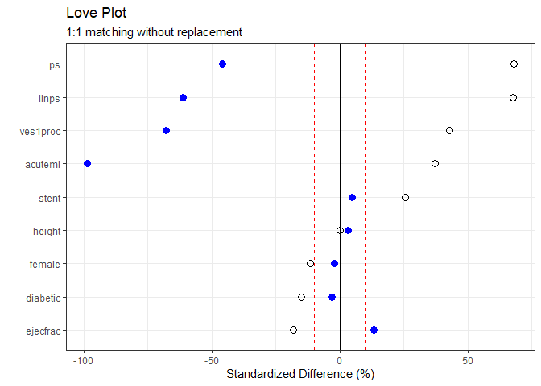<!-- -->

  - Visually, this 1:1 greedy matching doesn’t appear to be adequate.

## Using `cobalt` to make the Love Plot

Here’s a somewhat automated way to create the Love Plot.

``` r
cobalt_tab <- bal.tab(match1, treated ~ stent + height + female + diabetic + acutemi + ejecfrac + ves1proc + ps + linps, data=lindner_clean, un = TRUE)

cobalt_tab
```

    ## Balance Measures
    ##             Type Diff.Un Diff.Adj
    ## stent     Binary  0.1210   0.0235
    ## height   Contin. -0.0003   0.0301
    ## female    Binary -0.0550  -0.0101
    ## diabetic  Binary -0.0636  -0.0134
    ## acutemi   Binary  0.1187  -0.0570
    ## ejecfrac Contin. -0.1810   0.1018
    ## ves1proc Contin.  0.3654  -0.2329
    ## ps       Contin.  0.6609  -0.2616
    ## linps    Contin.  0.6048  -0.2407
    ## 
    ## Sample sizes
    ##           Control Treated
    ## All           298     698
    ## Matched       298     298
    ## Unmatched       0     400

``` r
p <- love.plot(cobalt_tab, threshold = .1, size = 1.5,
var.order = "unadjusted",
title = "Standardized Differences after 1:1 Matching without replacement",
stars = "std")

p + theme_bw()
```

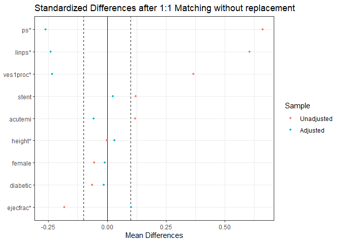<!-- -->

## Extracting Variance Ratios

``` r
pre.vratio <- NULL; post.vratio <- NULL
for(i in 1:length(covnames)) {
pre.vratio[i] <- mb1$BeforeMatching[[i]]$var.ratio
post.vratio[i] <- mb1$AfterMatching[[i]]$var.ratio
}
## Table of Variance Ratios
match_vrat <- data.frame(names = covnames, pre.vratio, post.vratio, row.names=covnames)
print(match_vrat, digits=2)
```

    ##             names pre.vratio post.vratio
    ## stent       stent       0.85       0.982
    ## height     height       1.02       0.934
    ## female     female       0.93       0.990
    ## diabetic diabetic       0.83       0.967
    ## acutemi   acutemi       2.59       0.059
    ## ejecfrac ejecfrac       1.02       0.612
    ## ves1proc ves1proc       2.16       0.256
    ## ps             ps       1.12       0.363
    ## linps       linps       1.67       0.257

## Creating a dataframe containing the matched sample

``` r
matches <- factor(rep(match1$index.treated, 2))
lindner_clean.matchedsample <- cbind(matches, lindner_clean[c(match1$index.control, match1$index.treated),])

# Check to see if sample makes sense
lindner_clean.matchedsample %>% count(treated_f)
```

    ## # A tibble: 2 x 2
    ##   treated_f     n
    ##   <fct>     <int>
    ## 1 treated     298
    ## 2 control     298

## Reassessing Rubin’s Rules after 1:1 matching without replacement

### Rubin’s Rule 1

``` r
rubin1.match <- with(lindner_clean.matchedsample,
abs(100*(mean(linps[treated==1])-mean(linps[treated==0]))/sd(linps)))
rubin1.match
```

    ## [1] 38.54801

The new value for Rubin’s Rule 1 is 38.55. While not ideal this
technically passes Rubin’s Rule 1 and is an improvement from the
pre-match value of 61.87.

### Rubin’s Rule 2

``` r
rubin2.match <- with(lindner_clean.matchedsample, var(linps[treated==1])/var(linps[treated==0]))
rubin2.match
```

    ## [1] 0.2570156

The new value for Rubin’s Rule 2 is 0.26. This does not pass Rubin’s
Rule 2 and is not an improvement from the pre-match value of 1.67.

# Task 5: Estimating the causal effect of the treatment on both outcomes after 1:1 matching without replacement

## The Quantitative outcome

We’ll use a mixed model to estimate the effect of the treatment on
`cardbill`.

  - The matches will be treated as a random effect (syntax “(1|
    matches.f)”

  - Treatment group will be treated as a fixed effect.

  - Restricted maximum likelihood (REML) used to estimate coefficient
    values.

<!-- end list -->

``` r
#to appease lme4, factor the matches 
lindner_clean.matchedsample$matches.f <- as.factor(lindner_clean.matchedsample$matches)

# fit the mixed model
matched_mixedmodel.out1 <- lmer(cardbill ~ treated + (1 | matches.f), REML = TRUE, data=lindner_clean.matchedsample)

summary(matched_mixedmodel.out1)
```

    ## Linear mixed model fit by REML ['lmerMod']
    ## Formula: cardbill ~ treated + (1 | matches.f)
    ##    Data: lindner_clean.matchedsample
    ## 
    ## REML criterion at convergence: 12815.1
    ## 
    ## Scaled residuals: 
    ##     Min      1Q  Median      3Q     Max 
    ## -1.0477 -0.4300 -0.2531  0.0836 13.7492 
    ## 
    ## Random effects:
    ##  Groups    Name        Variance  Std.Dev.
    ##  matches.f (Intercept)   6857606  2619   
    ##  Residual              127829248 11306   
    ## Number of obs: 596, groups:  matches.f, 298
    ## 
    ## Fixed effects:
    ##             Estimate Std. Error t value
    ## (Intercept)  14614.2      672.3  21.738
    ## treated       -385.5      926.2  -0.416
    ## 
    ## Correlation of Fixed Effects:
    ##         (Intr)
    ## treated -0.689

``` r
confint(matched_mixedmodel.out1)
```

    ## Computing profile confidence intervals ...

    ##                 2.5 %    97.5 %
    ## .sig01          0.000  4744.949
    ## .sigma      10438.237 12200.032
    ## (Intercept) 13296.648 15931.795
    ## treated     -2203.686  1432.712

``` r
tidy_mixed_matched <- tidy(matched_mixedmodel.out1, conf.int = TRUE, conf.level = 0.95) %>% filter(term == "treated")
tidy_mixed_matched
```

    ## # A tibble: 1 x 7
    ##   term    estimate std.error statistic conf.low conf.high group
    ##   <chr>      <dbl>     <dbl>     <dbl>    <dbl>     <dbl> <chr>
    ## 1 treated    -385.      926.    -0.416   -2201.     1430. fixed

Treated individuals were estimated to spend $-385.49 less (95%CI
-2200.88, 1429.9) than non-treated individuals. As this result is not
significant at an \(\alpha\) of 0.05, a sensitivity analysis on the
Quantitative outcome will not make sense.

``` r
#check the mean cardbill in the matched sample
lindner_clean.matchedsample %>% group_by(treated_f) %>% summarise(mean = mean(cardbill))
```

    ## # A tibble: 2 x 2
    ##   treated_f   mean
    ##   <fct>      <dbl>
    ## 1 treated   14229.
    ## 2 control   14614.

``` r
#check the mean cardbill in the entire sample
lindner_clean %>% group_by(treated_f) %>% summarise(mean = mean(cardbill))
```

    ## # A tibble: 2 x 2
    ##   treated_f   mean
    ##   <fct>      <dbl>
    ## 1 treated   16127.
    ## 2 control   14614.

In treated individuals, the mean `cardbill` was lower within the matched
sample than the entire sample (note the mean within the control group
was the same as every control participant is in the matched sample. The
mean changed in the treated group as only 298/698 treated patients are
in the matched sample). This is somewhat of a sanity check to assess if
the mixed model results make sense. It looks like they do.

## The binary outcome

  - We will use conditional logistic regression to estimate the log odds
    (and ORs) of being alive after 6 months based on treatment status.

<!-- end list -->

``` r
binary_outcome_adjusted <- survival::clogit(sixMonthSurvive ~ treated + strata(matches), data=lindner_clean.matchedsample)

summary(binary_outcome_adjusted)
```

    ## Call:
    ## coxph(formula = Surv(rep(1, 596L), sixMonthSurvive) ~ treated + 
    ##     strata(matches), data = lindner_clean.matchedsample, method = "exact")
    ## 
    ##   n= 596, number of events= 578 
    ## 
    ##           coef exp(coef) se(coef)     z Pr(>|z|)  
    ## treated 1.6094    5.0000   0.6325 2.545   0.0109 *
    ## ---
    ## Signif. codes:  0 '***' 0.001 '**' 0.01 '*' 0.05 '.' 0.1 ' ' 1
    ## 
    ##         exp(coef) exp(-coef) lower .95 upper .95
    ## treated         5        0.2     1.448     17.27
    ## 
    ## Concordance= 0.833  (se = 0.124 )
    ## Likelihood ratio test= 8.73  on 1 df,   p=0.003
    ## Wald test            = 6.48  on 1 df,   p=0.01
    ## Score (logrank) test = 8  on 1 df,   p=0.005

``` r
#Tidy model
tidy_binary_outcome_adjusted <- tidy(binary_outcome_adjusted, exponentiate = TRUE)
```

The odds of being alive after six months were 5 times higher in treated
individuals than non-treated individuals (95%CI 1.45, 17.27)

# Task 6 1:1 Matching With replacement

  - Matching **With** replacement

  - As we saw in the 1:1 matching without replacement, 400 treated
    participants were excluded from the sample. This is a waste of data.
    We’ll address this by again matching 1 treated participant to 1
    control participant. However, this time we’ll match with
    replacement, meaning each time a control participant is matched to a
    treated participant, the control participant will be placed back
    into the pool of possible patients a treated individual can be
    matched to. Thus, some control participants will be matched multiple
    times (not all control participants have to be matched to a treated
    participant). In the Lindner dataset 1:1 matching with replacement
    is a more reasonable choice.

<!-- end list -->

``` r
X <- lindner_clean$linps ## matching on the linear propensity score
Tr <- as.logical(lindner_clean$treated)
match1 <- Match(Tr=Tr, X=X, M = 1, replace=TRUE, ties=FALSE) # notice replace =  TRUE
summary(match1)
```

    ## 
    ## Estimate...  0 
    ## SE.........  0 
    ## T-stat.....  NaN 
    ## p.val......  NA 
    ## 
    ## Original number of observations..............  996 
    ## Original number of treated obs...............  698 
    ## Matched number of observations...............  698 
    ## Matched number of observations  (unweighted).  698

  - Matched 698 treated individuals with 698 control participants.

  - To reiterate, as we matched with replacement, and there were less
    control participants than treated participants, some control
    participants were matched multiple times.

Below we’ll assess the match balance from the 1:1 matching with
replacement.

``` r
set.seed(20202)
mb1 <- MatchBalance(treated ~ stent + height + female + diabetic + acutemi + ejecfrac + ves1proc + ps + linps, data=lindner_clean,
match.out = match1, nboots=500)
```

    ## 
    ## ***** (V1) stent *****
    ##                        Before Matching        After Matching
    ## mean treatment........    0.70487            0.70487 
    ## mean control..........    0.58389            0.73209 
    ## std mean diff.........     26.505            -5.9638 
    ## 
    ## mean raw eQQ diff.....    0.12081           0.027221 
    ## med  raw eQQ diff.....          0                  0 
    ## max  raw eQQ diff.....          1                  1 
    ## 
    ## mean eCDF diff........   0.060489            0.01361 
    ## med  eCDF diff........   0.060489            0.01361 
    ## max  eCDF diff........    0.12098           0.027221 
    ## 
    ## var ratio (Tr/Co).....    0.85457             1.0606 
    ## T-test p-value........ 0.00032255            0.15077 
    ## 
    ## 
    ## ***** (V2) height *****
    ##                        Before Matching        After Matching
    ## mean treatment........     171.44             171.44 
    ## mean control..........     171.45              171.6 
    ## std mean diff.........  -0.033804            -1.4601 
    ## 
    ## mean raw eQQ diff.....    0.56376            0.86963 
    ## med  raw eQQ diff.....          0                  0 
    ## max  raw eQQ diff.....         20                 22 
    ## 
    ## mean eCDF diff........  0.0078996           0.011143 
    ## med  eCDF diff........  0.0060095           0.008596 
    ## max  eCDF diff........   0.024971            0.04298 
    ## 
    ## var ratio (Tr/Co).....     1.0201            0.80051 
    ## T-test p-value........    0.99608            0.78876 
    ## KS Bootstrap p-value..      0.956              0.334 
    ## KS Naive p-value......    0.99947            0.53938 
    ## KS Statistic..........   0.024971            0.04298 
    ## 
    ## 
    ## ***** (V3) female *****
    ##                        Before Matching        After Matching
    ## mean treatment........    0.33095            0.33095 
    ## mean control..........    0.38591            0.29513 
    ## std mean diff.........    -11.672             7.6061 
    ## 
    ## mean raw eQQ diff.....   0.053691           0.035817 
    ## med  raw eQQ diff.....          0                  0 
    ## max  raw eQQ diff.....          1                  1 
    ## 
    ## mean eCDF diff........    0.02748           0.017908 
    ## med  eCDF diff........    0.02748           0.017908 
    ## max  eCDF diff........    0.05496           0.035817 
    ## 
    ## var ratio (Tr/Co).....    0.93253             1.0644 
    ## T-test p-value........    0.10045            0.10272 
    ## 
    ## 
    ## ***** (V4) diabetic *****
    ##                        Before Matching        After Matching
    ## mean treatment........    0.20487            0.20487 
    ## mean control..........    0.26846            0.22063 
    ## std mean diff.........    -15.743            -3.9018 
    ## 
    ## mean raw eQQ diff.....   0.063758           0.015759 
    ## med  raw eQQ diff.....          0                  0 
    ## max  raw eQQ diff.....          1                  1 
    ## 
    ## mean eCDF diff........   0.031793          0.0078797 
    ## med  eCDF diff........   0.031793          0.0078797 
    ## max  eCDF diff........   0.063585           0.015759 
    ## 
    ## var ratio (Tr/Co).....    0.82788            0.94735 
    ## T-test p-value........    0.03402            0.41872 
    ## 
    ## 
    ## ***** (V5) acutemi *****
    ##                        Before Matching        After Matching
    ## mean treatment........    0.17908            0.17908 
    ## mean control..........   0.060403            0.16332 
    ## std mean diff.........     30.931             4.1072 
    ## 
    ## mean raw eQQ diff.....    0.11745           0.015759 
    ## med  raw eQQ diff.....          0                  0 
    ## max  raw eQQ diff.....          1                  1 
    ## 
    ## mean eCDF diff........    0.05934          0.0078797 
    ## med  eCDF diff........    0.05934          0.0078797 
    ## max  eCDF diff........    0.11868           0.015759 
    ## 
    ## var ratio (Tr/Co).....     2.5853             1.0758 
    ## T-test p-value........ 4.6617e-09            0.28303 
    ## 
    ## 
    ## ***** (V6) ejecfrac *****
    ##                        Before Matching        After Matching
    ## mean treatment........     50.403             50.403 
    ## mean control..........     52.289             50.771 
    ## std mean diff.........    -18.102             -3.534 
    ## 
    ## mean raw eQQ diff.....     2.0503            0.80659 
    ## med  raw eQQ diff.....          1                  0 
    ## max  raw eQQ diff.....         20                 20 
    ## 
    ## mean eCDF diff........   0.035602           0.012201 
    ## med  eCDF diff........   0.011423          0.0071633 
    ## max  eCDF diff........    0.11383           0.065903 
    ## 
    ## var ratio (Tr/Co).....     1.0238             1.1022 
    ## T-test p-value........  0.0085806            0.47546 
    ## KS Bootstrap p-value..      0.002              0.022 
    ## KS Naive p-value......  0.0089219           0.096474 
    ## KS Statistic..........    0.11383           0.065903 
    ## 
    ## 
    ## ***** (V7) ves1proc *****
    ##                        Before Matching        After Matching
    ## mean treatment........     1.4628             1.4628 
    ## mean control..........     1.2047             1.4599 
    ## std mean diff.........     36.545            0.40578 
    ## 
    ## mean raw eQQ diff.....     0.2651           0.048711 
    ## med  raw eQQ diff.....          0                  0 
    ## max  raw eQQ diff.....          1                  1 
    ## 
    ## mean eCDF diff........   0.043323          0.0081184 
    ## med  eCDF diff........  0.0090671           0.006447 
    ## max  eCDF diff........    0.18842           0.018625 
    ## 
    ## var ratio (Tr/Co).....     2.1614              1.095 
    ## T-test p-value........   4.21e-11            0.91017 
    ## KS Bootstrap p-value.. < 2.22e-16              0.566 
    ## KS Naive p-value...... 7.2635e-07            0.99973 
    ## KS Statistic..........    0.18842           0.018625 
    ## 
    ## 
    ## ***** (V8) ps *****
    ##                        Before Matching        After Matching
    ## mean treatment........     0.7265             0.7265 
    ## mean control..........    0.64061            0.72619 
    ## std mean diff.........     66.092              0.239 
    ## 
    ## mean raw eQQ diff.....   0.085216          0.0014026 
    ## med  raw eQQ diff.....   0.081353         0.00064318 
    ## max  raw eQQ diff.....    0.12087           0.021689 
    ## 
    ## mean eCDF diff........    0.17141          0.0032132 
    ## med  eCDF diff........    0.17768          0.0014327 
    ## max  eCDF diff........    0.27599           0.024355 
    ## 
    ## var ratio (Tr/Co).....     1.1161             1.0083 
    ## T-test p-value........ < 2.22e-16          0.0025152 
    ## KS Bootstrap p-value.. < 2.22e-16              0.978 
    ## KS Naive p-value......  3.042e-14            0.98578 
    ## KS Statistic..........    0.27599           0.024355 
    ## 
    ## 
    ## ***** (V9) linps *****
    ##                        Before Matching        After Matching
    ## mean treatment........     1.1148             1.1148 
    ## mean control..........    0.63332             1.1079 
    ## std mean diff.........     60.484            0.86436 
    ## 
    ## mean raw eQQ diff.....     0.4787            0.01628 
    ## med  raw eQQ diff.....    0.35992          0.0028864 
    ## max  raw eQQ diff.....     1.0113            0.75735 
    ## 
    ## mean eCDF diff........    0.17141          0.0032132 
    ## med  eCDF diff........    0.17768          0.0014327 
    ## max  eCDF diff........    0.27599           0.024355 
    ## 
    ## var ratio (Tr/Co).....      1.672             1.0465 
    ## T-test p-value........ < 2.22e-16          0.0015098 
    ## KS Bootstrap p-value.. < 2.22e-16              0.978 
    ## KS Naive p-value......  3.042e-14            0.98578 
    ## KS Statistic..........    0.27599           0.024355 
    ## 
    ## 
    ## Before Matching Minimum p.value: < 2.22e-16 
    ## Variable Name(s): ves1proc ps linps  Number(s): 7 8 9 
    ## 
    ## After Matching Minimum p.value: 0.0015098 
    ## Variable Name(s): linps  Number(s): 9

Name variables in matchbalance output.

``` r
covnames <- c("stent", "height", "female", "diabetic", "acutemi", "ejecfrac", "ves1proc", "ps", "linps")
```

Dr. Love’s code to extract the standardized differences.

``` r
pre.szd <- NULL; post.szd <- NULL
for(i in 1:length(covnames)) {
pre.szd[i] <- mb1$BeforeMatching[[i]]$sdiff.pooled
post.szd[i] <- mb1$AfterMatching[[i]]$sdiff.pooled
}
```

Table standardized differences

``` r
match_szd <- data.frame(covnames, pre.szd, post.szd, row.names=covnames)
print(match_szd, digits=3)
```

    ##          covnames pre.szd post.szd
    ## stent       stent  25.445   -5.964
    ## height     height  -0.034   -1.460
    ## female     female -11.466    7.606
    ## diabetic diabetic -14.983   -3.902
    ## acutemi   acutemi  37.145    4.107
    ## ejecfrac ejecfrac -18.208   -3.534
    ## ves1proc ves1proc  42.734    0.406
    ## ps             ps  67.880    0.239
    ## linps       linps  67.664    0.864

## Love Plot of standardized differences before and after 1:1 matching

## Using ggplot

Blue points are post-adjustment; white are pre-adjustment.

``` r
lp_w_rep <- ggplot(match_szd, aes(x = pre.szd, y = reorder(covnames, pre.szd))) +
geom_point(col = "black", size = 3, pch = 1) +
geom_point(aes(x = post.szd, y = reorder(covnames, pre.szd)),
size = 3, col = "blue") +
theme_bw() +
geom_vline(aes(xintercept = 0)) +
geom_vline(aes(xintercept = 10), linetype = "dashed", col = "red") +
geom_vline(aes(xintercept = -10), linetype = "dashed", col = "red") +
labs(x = "Standardized Difference (%)", 
     y = "",
     title = "Love Plot",
     subtitle = "1:1 matching with replacement")

lp_w_rep
```

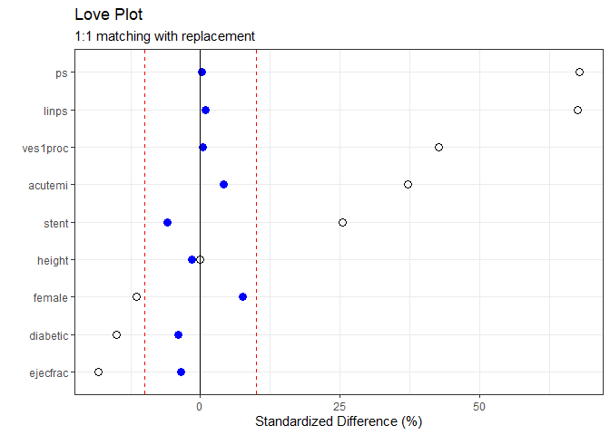<!-- -->

  - Visually, the Love Plot using 1:1 matching with replacement looks
    pretty good.

<!-- end list -->

``` r
# comparison of love plots with and without replacement
lp_wo_rep +  lp_w_rep
```

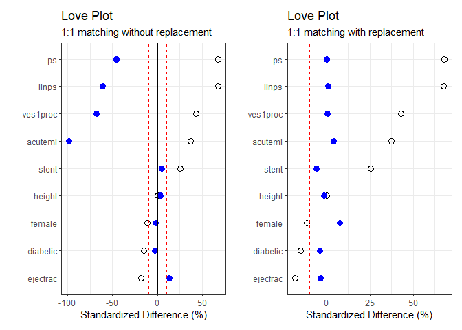<!-- -->

  - It definitely looks better than the 1:1 matching without
    replacement.

## Using `cobalt` to make the Love Plot

Here’s a somewhat automated way to create the Love Plot.

``` r
cobalt_tab <- bal.tab(match1, treated ~ stent + height + female + diabetic + acutemi + ejecfrac + ves1proc + ps + linps, data=lindner_clean, un = TRUE)

cobalt_tab
```

    ## Balance Measures
    ##             Type Diff.Un Diff.Adj
    ## stent     Binary  0.1210  -0.0272
    ## height   Contin. -0.0003  -0.0146
    ## female    Binary -0.0550   0.0358
    ## diabetic  Binary -0.0636  -0.0158
    ## acutemi   Binary  0.1187   0.0158
    ## ejecfrac Contin. -0.1810  -0.0353
    ## ves1proc Contin.  0.3654   0.0041
    ## ps       Contin.  0.6609   0.0024
    ## linps    Contin.  0.6048   0.0086
    ## 
    ## Sample sizes
    ##                      Control Treated
    ## All                  298.000     698
    ## Matched (ESS)        111.539     698
    ## Matched (Unweighted) 224.000     698
    ## Unmatched             74.000       0

``` r
p <- love.plot(cobalt_tab, threshold = .1, size = 1.5,
var.order = "unadjusted",
title = "Standardized Differences after 1:1 Matching With Replacement",
stars = "std")

p + theme_bw()
```

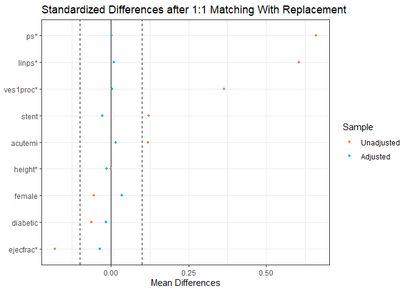<!-- -->

## Extracting Variance Ratios

``` r
pre.vratio <- NULL; post.vratio <- NULL
for(i in 1:length(covnames)) {
pre.vratio[i] <- mb1$BeforeMatching[[i]]$var.ratio
post.vratio[i] <- mb1$AfterMatching[[i]]$var.ratio
}
## Table of Variance Ratios
match_vrat <- data.frame(names = covnames, pre.vratio, post.vratio, row.names=covnames)
print(match_vrat, digits=2)
```

    ##             names pre.vratio post.vratio
    ## stent       stent       0.85        1.06
    ## height     height       1.02        0.80
    ## female     female       0.93        1.06
    ## diabetic diabetic       0.83        0.95
    ## acutemi   acutemi       2.59        1.08
    ## ejecfrac ejecfrac       1.02        1.10
    ## ves1proc ves1proc       2.16        1.10
    ## ps             ps       1.12        1.01
    ## linps       linps       1.67        1.05

## Creating a dataframe containing the matched sample

``` r
matches <- factor(rep(match1$index.treated, 2))
lindner_clean.matchedsample <- cbind(matches, lindner_clean[c(match1$index.control, match1$index.treated),])

# Check to see if sample makes sense
lindner_clean.matchedsample %>% count(treated_f)
```

    ## # A tibble: 2 x 2
    ##   treated_f     n
    ##   <fct>     <int>
    ## 1 treated     698
    ## 2 control     698

## Reassessing Rubin’s Rules after 1:1 matching with replacement

### Rubin’s Rule 1

``` r
rubin1.match.rep <- with(lindner_clean.matchedsample,
abs(100*(mean(linps[treated==1])-mean(linps[treated==0]))/sd(linps)))
rubin1.match.rep
```

    ## [1] 0.8744381

The new value for Rubin’s Rule 1 is 0.87. This value passes Rubin’s Rule
1 and is an improvement from the Rubin’s Rule 1 value obtained during
1:1 matching without replacement, 38.55. The pre-match value was 61.87.

### Rubin’s Rule 2

``` r
rubin2.match.rep <- with(lindner_clean.matchedsample, var(linps[treated==1])/var(linps[treated==0]))
rubin2.match.rep
```

    ## [1] 1.046535

The new value for Rubin’s Rule 2 is 1.05. This passes Rule 2 and is an
improvement from the Rubin’s Rule 2 value obtained during 1:1 matching
without replacement, 0.26. The pre-match value was 1.67.

## Estimating the causal effect of the treatment on both outcomes after 1:1 matching with replacement

### The Quantitative outcome

We’ll use a mixed model to estimate the effect of the treatment on
`cardbill`.

  - The matches will be treated as a random effect (syntax “(1|
    matches.f)”

  - Treatment group will be treated as a fixed effect.

  - Restricted maximum likelihood (REML) used to estimate coefficient
    values.

<!-- end list -->

``` r
#to appease lme4, factor the matches 
lindner_clean.matchedsample$matches.f <- as.factor(lindner_clean.matchedsample$matches)

# fit the mixed model
matched_mixedmodel.rep.out1 <- lmer(cardbill ~ treated + (1 | matches.f), REML = TRUE, data=lindner_clean.matchedsample)

summary(matched_mixedmodel.rep.out1)
```

    ## Linear mixed model fit by REML ['lmerMod']
    ## Formula: cardbill ~ treated + (1 | matches.f)
    ##    Data: lindner_clean.matchedsample
    ## 
    ## REML criterion at convergence: 30163.2
    ## 
    ## Scaled residuals: 
    ##     Min      1Q  Median      3Q     Max 
    ## -1.3315 -0.4755 -0.2775  0.1046 12.7773 
    ## 
    ## Random effects:
    ##  Groups    Name        Variance  Std.Dev.
    ##  matches.f (Intercept)  13127609  3623   
    ##  Residual              132224807 11499   
    ## Number of obs: 1396, groups:  matches.f, 698
    ## 
    ## Fixed effects:
    ##             Estimate Std. Error t value
    ## (Intercept)  16457.3      456.3  36.064
    ## treated       -330.6      615.5  -0.537
    ## 
    ## Correlation of Fixed Effects:
    ##         (Intr)
    ## treated -0.674

``` r
confint(matched_mixedmodel.rep.out1)
```

    ## Computing profile confidence intervals ...

    ##                 2.5 %     97.5 %
    ## .sig01       1538.427  4912.8815
    ## .sigma      10913.265 12120.8255
    ## (Intercept) 15562.908 17351.6653
    ## treated     -1537.801   876.5945

``` r
tidy_mixed_matched_rep <- tidy(matched_mixedmodel.rep.out1, conf.int = TRUE, conf.level = 0.95) %>% filter(term == "treated")
tidy_mixed_matched_rep
```

    ## # A tibble: 1 x 7
    ##   term    estimate std.error statistic conf.low conf.high group
    ##   <chr>      <dbl>     <dbl>     <dbl>    <dbl>     <dbl> <chr>
    ## 1 treated    -331.      616.    -0.537   -1537.      876. fixed

Treated individuals were estimated to spend $-330.6 less (95%CI -1537,
875.8) than non-treated individuals. This finding is not significant at
an \(\alpha\) of 0.05, thus, the sensitivity analysis on the
Quantitative outcome will still not make sense.

``` r
#sanity check for mondel
lindner_clean.matchedsample %>% group_by(treated_f) %>% summarise(mean_card = mean(cardbill))
```

    ## # A tibble: 2 x 2
    ##   treated_f mean_card
    ##   <fct>         <dbl>
    ## 1 treated      16127.
    ## 2 control      16457.

  - The mixed model above predicted treated individuals would spend
    roughly $-330.6 less than control participants. After doing a quick
    check of the mean `cardbill` within the matched sample, the mixed
    model results make sense.

### The binary outcome

  - We will use conditional logistic regression to estimate the log odds
    (and ORs) of being alive after 6 months based on treatment status.

<!-- end list -->

``` r
binary_outcome_adjusted_rep <- survival::clogit(sixMonthSurvive ~ treated + strata(matches), data=lindner_clean.matchedsample)

summary(binary_outcome_adjusted_rep)
```

    ## Call:
    ## coxph(formula = Surv(rep(1, 1396L), sixMonthSurvive) ~ treated + 
    ##     strata(matches), data = lindner_clean.matchedsample, method = "exact")
    ## 
    ##   n= 1396, number of events= 1323 
    ## 
    ##           coef exp(coef) se(coef)   z Pr(>|z|)    
    ## treated 1.8083    6.1000   0.3412 5.3 1.16e-07 ***
    ## ---
    ## Signif. codes:  0 '***' 0.001 '**' 0.01 '*' 0.05 '.' 0.1 ' ' 1
    ## 
    ##         exp(coef) exp(-coef) lower .95 upper .95
    ## treated       6.1     0.1639     3.126     11.91
    ## 
    ## Concordance= 0.859  (se = 0.058 )
    ## Likelihood ratio test= 40.7  on 1 df,   p=2e-10
    ## Wald test            = 28.09  on 1 df,   p=1e-07
    ## Score (logrank) test = 36.63  on 1 df,   p=1e-09

``` r
#Tidy model
tidy_binary_outcome_adjusted_rep <- tidy(binary_outcome_adjusted_rep, exponentiate = TRUE)
```

The odds of being alive after six months were 6.1 times higher in
treated individuals than non-treated individuals (95%CI 3.13, 11.91)

# Task 7: Subclassification by PS quintile

``` r
#cut into quintiles
lindner_clean$stratum <- Hmisc::cut2(lindner_clean$ps, g=5)
lindner_clean$quintile <- factor(lindner_clean$stratum, labels=1:5)

#Sanity check: check to make sure quntiles are evenish, numbers make sense, etc.
lindner_clean %>% count(stratum, quintile) 
```

    ## # A tibble: 5 x 3
    ##   stratum       quintile     n
    ##   <fct>         <fct>    <int>
    ## 1 [0.232,0.581) 1          200
    ## 2 [0.581,0.669) 2          199
    ## 3 [0.669,0.726) 3          200
    ## 4 [0.726,0.826) 4          199
    ## 5 [0.826,0.980] 5          198

## Check Balance and Propensity Score Overlap in Each Quintile

### Numerically

Only 20 control individuals were contained in the largest quintile. This
is seems low.

``` r
lindner_clean %>% count(quintile, treated_f)
```

    ## # A tibble: 10 x 3
    ##    quintile treated_f     n
    ##    <fct>    <fct>     <int>
    ##  1 1        treated     105
    ##  2 1        control      95
    ##  3 2        treated     124
    ##  4 2        control      75
    ##  5 3        treated     135
    ##  6 3        control      65
    ##  7 4        treated     156
    ##  8 4        control      43
    ##  9 5        treated     178
    ## 10 5        control      20

### Graphically

``` r
ggplot(lindner_clean, aes(x = treated_f, y = round(ps,2), group = quintile, color = treated_f)) +
geom_jitter(width = 0.2) +
guides(color = FALSE) +
facet_wrap(~ quintile, scales = "free_y") +
labs(x = "", y = "Propensity for Treatment",
title = "Quintile Subclassification in the Lindner data")
```

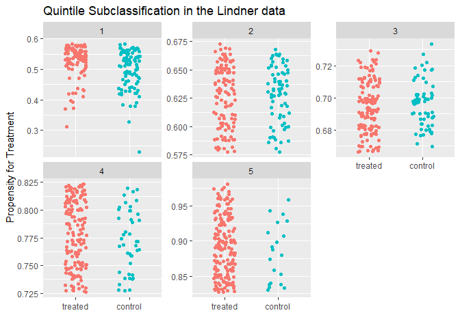<!-- -->

## Creating a Standardized Difference Calculation Function

Dr. Love’s function to calculate the standardizes differences is
utilized below.

``` r
szd <- function(covlist, g) {
covlist2 <- as.matrix(covlist)
g <- as.factor(g)
res <- NA
for(i in 1:ncol(covlist2)) {
cov <- as.numeric(covlist2[,i])
num <- 100*diff(tapply(cov, g, mean, na.rm=TRUE))
den <- sqrt(mean(tapply(cov, g, var, na.rm=TRUE)))
res[i] <- round(num/den,2)
}
names(res) <- names(covlist)
res
}
```

Split data into quintiles - and give them each their own dataframe.

``` r
quin1 <- filter(lindner_clean, quintile==1)
quin2 <- filter(lindner_clean, quintile==2)
quin3 <- filter(lindner_clean, quintile==3)
quin4 <- filter(lindner_clean, quintile==4)
quin5 <- filter(lindner_clean, quintile==5)
```

Now we’ll run the function above to calculate the standardized
differences for each covariate in each quintile.

``` r
covs <- c("stent", "height", "female", "diabetic", "acutemi", "ejecfrac", "ves1proc", "ps", "linps")
d.q1 <- szd(quin1[covs], quin1$treated)
d.q2 <- szd(quin2[covs], quin2$treated)
d.q3 <- szd(quin3[covs], quin3$treated)
d.q4 <- szd(quin4[covs], quin4$treated)
d.q5 <- szd(quin5[covs], quin5$treated)
d.all <- szd(lindner_clean[covs], lindner_clean$treated)
lindner_clean.szd <- data_frame(covs, Overall = d.all, Q1 = d.q1, Q2 = d.q2, Q3 = d.q3, Q4 = d.q4, Q5 = d.q5)
```

    ## Warning: `data_frame()` is deprecated, use `tibble()`.
    ## This warning is displayed once per session.

``` r
lindner_clean.szd <- gather(lindner_clean.szd, "quint", "sz.diff", 2:7)
```

## Plotting the post-subclassification standardized differences

``` r
ggplot(lindner_clean.szd, aes(x = sz.diff, y = reorder(covs, -sz.diff), group = quint)) +
geom_point() +
geom_vline(xintercept = 0) +
geom_vline(xintercept = c(-10,10), linetype = "dashed", col = "blue") +
facet_wrap(~ quint) +
labs(x = "Standardized Difference, %", y = "",
title = "Comparing Standardized Differences by PS Quintile")
```

    ## Warning: Removed 1 rows containing missing values (geom_point).

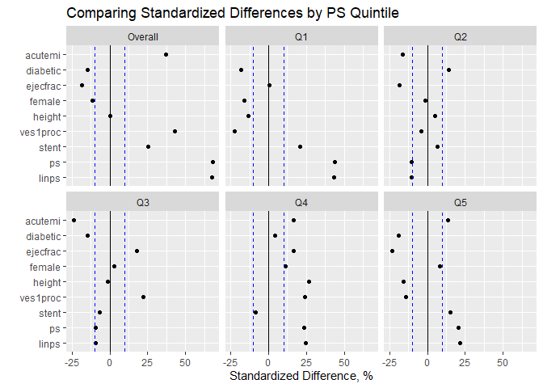<!-- -->

The results of the standardized differences by quintile are varied.

## Rubin’s Rules post subclassification

### Rule 1

``` r
rubin1.q1 <- with(quin1, abs(100*(mean(linps[treated==1]) - mean(linps[treated==0]))/sd(linps)))

rubin1.q2 <- with(quin2, abs(100*(mean(linps[treated==1]) -mean(linps[treated==0]))/sd(linps)))

rubin1.q3 <- with(quin3, abs(100*(mean(linps[treated==1]) -mean(linps[treated==0]))/sd(linps)))

rubin1.q4 <- with(quin4, abs(100*(mean(linps[treated==1]) -mean(linps[treated==0]))/sd(linps)))

rubin1.q5 <- with(quin5, abs(100*(mean(linps[treated==1]) -mean(linps[treated==0]))/sd(linps)))

rubin1.sub <- c(rubin1.q1, rubin1.q2, rubin1.q3, rubin1.q4, rubin1.q5)
names(rubin1.sub)=c("Q1", "Q2", "Q3", "Q4", "Q5")

rubin1.sub
```

    ##        Q1        Q2        Q3        Q4        Q5 
    ## 42.633282 10.122973  9.054266 23.662028 20.717673

All under 50. Not great, but OK. For comparison, the original Rubin’s
Rule 1 value was 61.87.

### Rule 2

``` r
rubin2.q1 <- with(quin1, var(linps[treated==1])/var(linps[treated==0]))
rubin2.q2 <- with(quin2, var(linps[treated==1])/var(linps[treated==0]))
rubin2.q3 <- with(quin3, var(linps[treated==1])/var(linps[treated==0]))
rubin2.q4 <- with(quin4, var(linps[treated==1])/var(linps[treated==0]))
rubin2.q5 <- with(quin5, var(linps[treated==1])/var(linps[treated==0]))

rubin2.sub <- c(rubin2.q1, rubin2.q2, rubin2.q3, rubin2.q4, rubin2.q5)
names(rubin2.sub)=c("Q1", "Q2", "Q3", "Q4", "Q5")
rubin2.sub
```

    ##        Q1        Q2        Q3        Q4        Q5 
    ## 0.6582169 1.2083230 1.1754770 1.2154060 1.2353984

All but Q1 are at least close to passing Rule 2. For comparison, the
original Rubin’s Rule 2 value was 1.67.

# Task 8: Estimated effect after subclassification

## Quantitative outcome

``` r
quin1.out1 <- lm(cardbill ~ treated, data=quin1)
quin2.out1 <- lm(cardbill ~ treated, data=quin2)
quin3.out1 <- lm(cardbill ~ treated, data=quin3)
quin4.out1 <- lm(cardbill ~ treated, data=quin4)
quin5.out1 <- lm(cardbill ~ treated, data=quin5)

coef(summary(quin1.out1)); coef(summary(quin2.out1)); coef(summary(quin3.out1)); coef(summary(quin4.out1)); coef(summary(quin5.out1)) 
```

    ##                Estimate Std. Error     t value     Pr(>|t|)
    ## (Intercept) 14262.49474   1083.197 13.16704155 7.497113e-29
    ## treated       -67.69474   1494.953 -0.04528217 9.639280e-01

    ##              Estimate Std. Error  t value     Pr(>|t|)
    ## (Intercept) 15038.427   1794.884 8.378497 1.000329e-14
    ## treated      1412.154   2273.799 0.621055 5.352814e-01

    ##              Estimate Std. Error  t value     Pr(>|t|)
    ## (Intercept) 13259.415   1099.734 12.05693 1.846022e-25
    ## treated      2837.814   1338.554  2.12006 3.524616e-02

    ##             Estimate Std. Error  t value     Pr(>|t|)
    ## (Intercept) 14474.19   1620.396 8.932501 2.966193e-16
    ## treated      2979.16   1830.144 1.627828 1.051596e-01

    ##              Estimate Std. Error   t value     Pr(>|t|)
    ## (Intercept) 19398.350   1967.305  9.860368 7.011002e-19
    ## treated     -3498.063   2074.886 -1.685906 9.340509e-02

The mean of the five quintile-specific estimated regression coefficients
is below.

``` r
est.st <- (coef(quin1.out1)[2] + coef(quin2.out1)[2] + coef(quin3.out1)[2] +
coef(quin4.out1)[2] + coef(quin5.out1)[2])/5

est.st
```

    ## treated 
    ## 732.674

The mean SE is below.

``` r
se.q1 <- summary(quin1.out1)$coefficients[2,2]
se.q2 <- summary(quin2.out1)$coefficients[2,2]
se.q3 <- summary(quin3.out1)$coefficients[2,2]
se.q4 <- summary(quin4.out1)$coefficients[2,2]
se.q5 <- summary(quin5.out1)$coefficients[2,2]

se.st <- sqrt((se.q1^2 + se.q2^2 + se.q3^2 + se.q4^2 + se.q5^2)*(1/25))
se.st
```

    ## [1] 821.008

The mean estimate, with a 95%CI, is below.

``` r
strat.result1 <- data_frame(estimate = est.st,
conf.low = est.st - 1.96*se.st,
conf.high = est.st + 1.96*se.st)
strat.result1
```

    ## # A tibble: 1 x 3
    ##   estimate conf.low conf.high
    ##      <dbl>    <dbl>     <dbl>
    ## 1     733.    -877.     2342.

So treated individuals were estimated to spend $732.67 more (95%CI
-876.5, 2341.85) than non treated individuals.

## Binary Outcome

``` r
quin1.out2 <- glm(sixMonthSurvive ~ treated, data=quin1, family=binomial())
quin2.out2 <- glm(sixMonthSurvive ~ treated, data=quin2, family=binomial())
quin3.out2 <- glm(sixMonthSurvive ~ treated, data=quin3, family=binomial())
quin4.out2 <- glm(sixMonthSurvive ~ treated, data=quin4, family=binomial())
quin5.out2 <- glm(sixMonthSurvive ~ treated, data=quin5, family=binomial())

coef(summary(quin1.out2)); coef(summary(quin2.out2)); coef(summary(quin3.out2)); coef(summary(quin4.out2)); coef(summary(quin5.out2))
```

    ##             Estimate Std. Error  z value     Pr(>|z|)
    ## (Intercept) 3.124565  0.5108708 6.116155 9.586018e-10
    ## treated     1.519826  1.1272001 1.348319 1.775557e-01

    ##             Estimate Std. Error  z value     Pr(>|z|)
    ## (Intercept) 2.876386  0.5138915 5.597262 2.177636e-08
    ## treated     1.935799  1.1278865 1.716306 8.610597e-02

    ##             Estimate Std. Error  z value     Pr(>|z|)
    ## (Intercept) 3.028522  0.5911534 5.123073 3.005960e-07
    ## treated     1.869318  1.1648042 1.604834 1.085303e-01

    ##             Estimate Std. Error   z value     Pr(>|z|)
    ## (Intercept) 3.737670   1.011815 3.6940239 0.0002207331
    ## treated     0.194156   1.167726 0.1662684 0.8679457146

    ##             Estimate Std. Error  z value    Pr(>|z|)
    ## (Intercept) 1.734601  0.6262243 2.769936 0.005606735
    ## treated     1.809253  0.7732630 2.339764 0.019295953

Estimated log-odds (averaged over the quintiles).

``` r
est.st.log <- (coef(quin1.out2)[2] + coef(quin2.out2)[2] + coef(quin3.out2)[2] +
coef(quin4.out2)[2] + coef(quin5.out2)[2])/5

est.st.log
```

    ## treated 
    ## 1.46567

Estimated odds ratio (averaged over the quintiles).

``` r
exp(est.st.log)
```

    ##  treated 
    ## 4.330444

The average SE (averaged over the quintiles).

``` r
se.q1.log <- summary(quin1.out2)$coefficients[2,2]
se.q2.log <- summary(quin2.out2)$coefficients[2,2]
se.q3.log <- summary(quin3.out2)$coefficients[2,2]
se.q4.log <- summary(quin4.out2)$coefficients[2,2]
se.q5.log <- summary(quin5.out2)$coefficients[2,2]

se.st.log <- sqrt((se.q1.log^2 + se.q2.log^2 + se.q3.log^2 + se.q4.log^2 + se.q5.log^2)*(1/25))
se.st.log #log odds
```

    ## [1] 0.4841899

``` r
strat.result2 <- data_frame(estimate = exp(est.st.log),
conf.low = exp(est.st.log - 1.96*se.st.log),
conf.high = exp(est.st.log + 1.96*se.st.log))

strat.result2
```

    ## # A tibble: 1 x 3
    ##   estimate conf.low conf.high
    ##      <dbl>    <dbl>     <dbl>
    ## 1     4.33     1.68      11.2

The odds of being alive after 6 months was 4.33 times higher (95%CI
1.68, 11.19) in treated individuals than non-treated individuals.

# Task 9: Weighting

## Calculating the ATT and ATE weights

### ATT weights

  - Average treatment effect on the treated (ATT)

  - Weight treated subjects as 1; control subjects as ps/(1-ps)

<!-- end list -->

``` r
lindner_clean$wts1 <- ifelse(lindner_clean$treated==1, 1, lindner_clean$ps/(1-lindner_clean$ps))
```

### ATE weights

  - Average treatment effect (ATE)

  - Weight treated subjects by 1/ps; Control subjects by 1/(1-PS)

<!-- end list -->

``` r
lindner_clean$wts2 <- ifelse(lindner_clean$treated==1, 1/lindner_clean$ps, 1/(1-lindner_clean$ps))
```

## Working with the ATT weights

``` r
ggplot(lindner_clean, aes(x = ps, y = wts1, color = treated_f)) +
geom_point() +
guides(color = FALSE) +
facet_wrap(~ treated_f) +
labs(x = "Estimated Propensity for Treatment",
y = "ATT weight",
title = "ATT weighting structure")
```

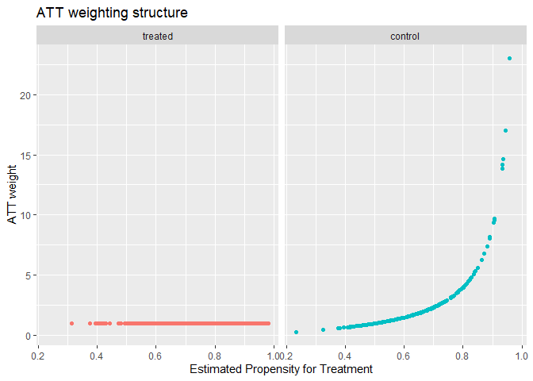<!-- -->

``` r
#turn dataset into a dataframe for twang (its a tibble now)
lindner_clean_df <- data.frame(lindner_clean)

#name covariates
covlist <- c("stent", "height", "female", "diabetic", "acutemi", "ejecfrac", "ves1proc", "ps", "linps")
```

``` r
bal.wts1 <- dx.wts(x=lindner_clean_df$wts1, data=lindner_clean_df, vars=covlist,
treat.var="treated", estimand="ATT")

bal.wts1
```

    ##   type n.treat n.ctrl ess.treat ess.ctrl     max.es    mean.es     max.ks
    ## 1  unw     698    298       698 298.0000 0.66091743 0.29567509 0.27599469
    ## 2          698    298       698 149.4503 0.08471131 0.03315857 0.06089807
    ##      mean.ks iter
    ## 1 0.13749095   NA
    ## 2 0.03182485   NA

``` r
bal.table(bal.wts1)
```

    ## $unw
    ##            tx.mn  tx.sd   ct.mn  ct.sd std.eff.sz   stat     p    ks ks.pval
    ## stent      0.705  0.456   0.584  0.494      0.265  3.624 0.000 0.121   0.004
    ## height   171.443 10.695 171.446 10.589      0.000 -0.005 0.996 0.025   0.999
    ## female     0.331  0.471   0.386  0.488     -0.117 -1.647 0.100 0.055   0.531
    ## diabetic   0.205  0.404   0.268  0.444     -0.157 -2.127 0.034 0.064   0.349
    ## acutemi    0.179  0.384   0.060  0.239      0.309  5.923 0.000 0.119   0.005
    ## ejecfrac  50.403 10.419  52.289 10.297     -0.181 -2.640 0.008 0.114   0.008
    ## ves1proc   1.463  0.706   1.205  0.480      0.365  6.693 0.000 0.188   0.000
    ## ps         0.727  0.130   0.641  0.123      0.661  9.928 0.000 0.276   0.000
    ## linps      1.115  0.796   0.633  0.616      0.605 10.321 0.000 0.276   0.000
    ## 
    ## [[2]]
    ##            tx.mn  tx.sd   ct.mn  ct.sd std.eff.sz   stat     p    ks ks.pval
    ## stent      0.705  0.456   0.702  0.458      0.005  0.065 0.948 0.002   1.000
    ## height   171.443 10.695 171.568 11.934     -0.012 -0.102 0.919 0.042   0.974
    ## female     0.331  0.471   0.311  0.464      0.042  0.497 0.620 0.020   1.000
    ## diabetic   0.205  0.404   0.235  0.425     -0.074 -0.716 0.474 0.030   1.000
    ## acutemi    0.179  0.384   0.180  0.385     -0.001 -0.011 0.991 0.001   1.000
    ## ejecfrac  50.403 10.419  50.384 10.358      0.002  0.019 0.985 0.032   0.999
    ## ves1proc   1.463  0.706   1.523  0.749     -0.085 -0.647 0.518 0.038   0.990
    ## ps         0.727  0.130   0.730  0.134     -0.030 -0.273 0.785 0.061   0.725
    ## linps      1.115  0.796   1.153  0.839     -0.048 -0.360 0.719 0.061   0.725

Calculate %s and tibble data.

``` r
bal.before.wts1 <- bal.table(bal.wts1)[1]
bal.after.wts1 <- bal.table(bal.wts1)[2]
balance.att.weights <- data_frame(names = rownames(bal.before.wts1$unw),
pre.weighting = 100*bal.before.wts1$unw$std.eff.sz,
ATT.weighted = 100*bal.after.wts1[[1]]$std.eff.sz)
balance.att.weights <- gather(balance.att.weights, timing, szd, 2:3)
```

Now we can plot the standardized differences after ATT weighting.

``` r
ggplot(balance.att.weights, aes(x = szd, y = reorder(names, szd), color = timing)) +
geom_point() +
geom_vline(xintercept = 0) +
geom_vline(xintercept = c(-10,10), linetype = "dashed", col = "blue") +
labs(x = "Standardized Difference", y = "",
title = "Standardized Difference before and after ATT Weighting")
```

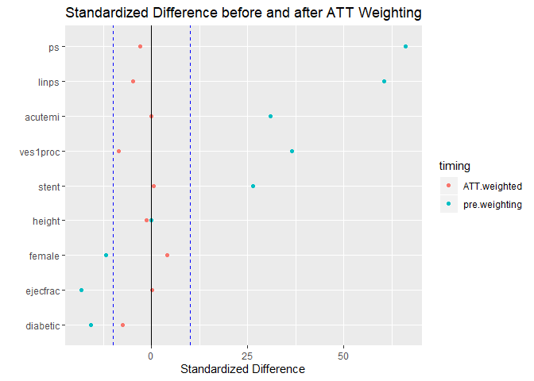<!-- -->

The standardized differences look much better here.

### Rubin’s Rules

#### Rule 1

**Numbers from balance table above**: (-0.048 \* 100) = 4.8%. So passes
Rule 1.

#### Rule 2

**Numbers from balance table
above**:(0.796<sup>2</sup>)/(0.839<sup>2</sup>) = 0.9001237. Passes Rule
2

### Estimated effect on outcomes after ATT weighting

#### Quantitative outcome

To estimate the effect of the treatment on `cardbill`, we’ll use svyglm
from the `survey` package to apply the ATT weights in a linear model.

``` r
lindnerwt1.design <- svydesign(ids=~1, weights=~wts1, data=lindner_clean) # using ATT weights

adjout1.wt1 <- svyglm(cardbill ~ treated, design=lindnerwt1.design)

wt_att_results1 <- tidy(adjout1.wt1, conf.int = TRUE) %>% filter(term == "treated")

wt_att_results1
```

    ## # A tibble: 1 x 7
    ##   term    estimate std.error statistic p.value conf.low conf.high
    ##   <chr>      <dbl>     <dbl>     <dbl>   <dbl>    <dbl>     <dbl>
    ## 1 treated    -239.     1417.    -0.169   0.866   -3017.     2538.

**Estimate (95%CI)** -239.28 (-3016.54, 2537.99)

#### Binary outcome

We’ll do similar coding for the binary outcome.

``` r
adjout2.wt1 <- svyglm(sixMonthSurvive ~ treated, design=lindnerwt1.design, family=quasibinomial())

wt_att_results2 <- tidy(adjout2.wt1, conf.int = TRUE, exponentiate = TRUE) %>%
filter(term == "treated")
wt_att_results2
```

    ## # A tibble: 1 x 7
    ##   term    estimate std.error statistic  p.value conf.low conf.high
    ##   <chr>      <dbl>     <dbl>     <dbl>    <dbl>    <dbl>     <dbl>
    ## 1 treated     6.50     0.537      3.49 0.000509     2.27      18.6

**Estimate (95%CI)** 6.5 (2.27, 18.63)

## Working with the ATE weights

We’ll go through the same steps with the ATE weights.

``` r
ggplot(lindner_clean, aes(x = ps, y = wts2, color = treated_f)) +
geom_point() +
guides(color = FALSE) +
facet_wrap(~ treated_f) +
labs(x = "Estimated Propensity for Treatment",
y = "ATE weights",
title = "ATE weighting structure")
```

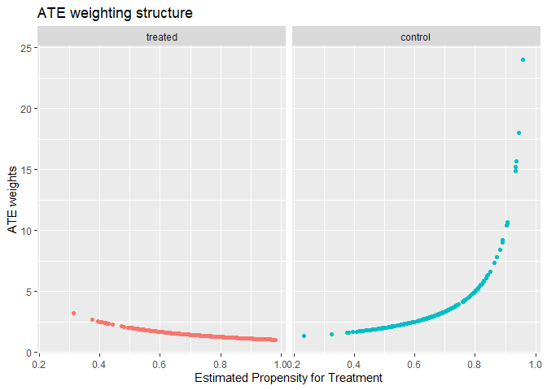<!-- -->

``` r
bal.wts2 <- dx.wts(x=lindner_clean_df$wts2, data=lindner_clean_df, vars=covlist,
treat.var="treated", estimand="ATE")

bal.wts2
```

    ##   type n.treat n.ctrl ess.treat ess.ctrl     max.es    mean.es     max.ks
    ## 1  unw     698    298   698.000 298.0000 0.64205075 0.29974928 0.27599469
    ## 2          698    298   671.093 199.6805 0.06536698 0.02344694 0.04595042
    ##      mean.ks iter
    ## 1 0.13749095   NA
    ## 2 0.02622715   NA

``` r
bal.table(bal.wts2)
```

    ## $unw
    ##            tx.mn  tx.sd   ct.mn  ct.sd std.eff.sz   stat     p    ks ks.pval
    ## stent      0.705  0.456   0.584  0.494      0.257  3.624 0.000 0.121   0.004
    ## height   171.443 10.695 171.446 10.589      0.000 -0.005 0.996 0.025   0.999
    ## female     0.331  0.471   0.386  0.488     -0.115 -1.647 0.100 0.055   0.531
    ## diabetic   0.205  0.404   0.268  0.444     -0.152 -2.127 0.034 0.064   0.349
    ## acutemi    0.179  0.384   0.060  0.239      0.338  5.923 0.000 0.119   0.005
    ## ejecfrac  50.403 10.419  52.289 10.297     -0.181 -2.640 0.008 0.114   0.008
    ## ves1proc   1.463  0.706   1.205  0.480      0.393  6.693 0.000 0.188   0.000
    ## ps         0.727  0.130   0.641  0.123      0.642  9.928 0.000 0.276   0.000
    ## linps      1.115  0.796   0.633  0.616      0.619 10.321 0.000 0.276   0.000
    ## 
    ## [[2]]
    ##            tx.mn  tx.sd   ct.mn  ct.sd std.eff.sz   stat     p    ks ks.pval
    ## stent      0.670  0.470   0.667  0.472      0.006  0.081 0.936 0.003   1.000
    ## height   171.404 10.602 171.532 11.552     -0.011 -0.124 0.902 0.038   0.974
    ## female     0.344  0.475   0.333  0.472      0.022  0.283 0.777 0.010   1.000
    ## diabetic   0.223  0.416   0.245  0.431     -0.052 -0.601 0.548 0.022   1.000
    ## acutemi    0.143  0.351   0.144  0.352     -0.003 -0.026 0.979 0.001   1.000
    ## ejecfrac  50.943 10.109  50.948 10.377      0.000 -0.006 0.995 0.042   0.934
    ## ves1proc   1.384  0.663   1.428  0.696     -0.065 -0.586 0.558 0.028   0.999
    ## ps         0.701  0.133   0.704  0.137     -0.018 -0.185 0.853 0.046   0.884
    ## linps      0.973  0.774   0.999  0.815     -0.033 -0.292 0.771 0.046   0.884

``` r
bal.before.wts2 <- bal.table(bal.wts2)[1]
bal.after.wts2 <- bal.table(bal.wts2)[2]
balance.ate.weights <- data_frame(names = rownames(bal.before.wts2$unw),
pre.weighting = 100*bal.before.wts2$unw$std.eff.sz,

ATE.weighted = 100*bal.after.wts2[[1]]$std.eff.sz)
balance.ate.weights <- gather(balance.ate.weights, timing, szd, 2:3)
```

``` r
ggplot(balance.ate.weights, aes(x = szd, y = reorder(names, szd), color = timing)) +
geom_point() +
geom_vline(xintercept = 0) +
geom_vline(xintercept = c(-10,10), linetype = "dashed", col = "blue") +
labs(x = "Standardized Difference", y = "",
title = "Standardized Difference before and after ATE Weighting")
```

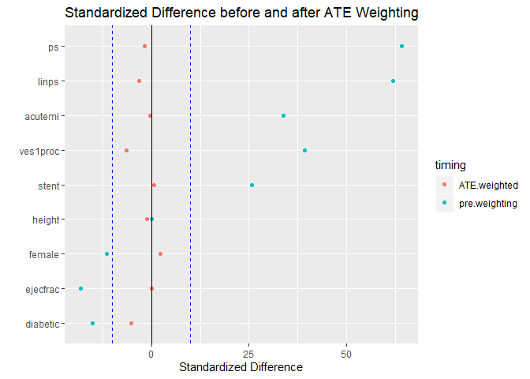<!-- -->

Again, the standardized differences look good here.

### Rubin’s Rules

#### Rule 1

\-0.033\*100 = 3.3%. Passes Rule 1 (numbers from ATE weight balance
table above).

#### Rule 2

(0.774<sup>2</sup>)/(0.815<sup>2</sup>) = 0.9019173. Passes Rule 2
(numbers from ATE weight balance table above).

### Estimated effect on outcomes after ATE weighting

#### Quantitative outcome

``` r
lindnerwt2.design <- svydesign(ids=~1, weights=~wts2, data=lindner_clean) # using ATE weights

adjout1.wt2 <- svyglm(cardbill ~ treated, design=lindnerwt2.design)

wt_ate_results1 <- tidy(adjout1.wt2, conf.int = TRUE) %>% filter(term == "treated")
wt_ate_results1
```

    ## # A tibble: 1 x 7
    ##   term    estimate std.error statistic p.value conf.low conf.high
    ##   <chr>      <dbl>     <dbl>     <dbl>   <dbl>    <dbl>     <dbl>
    ## 1 treated     147.     1192.     0.124   0.902   -2190.     2484.

**Estimate (95%CI)** 147.26 (-2189.63, 2484.15)

#### Binary outcome

``` r
adjout2.wt2 <- svyglm(sixMonthSurvive ~ treated, design=lindnerwt2.design, family=quasibinomial())

wt_ate_results2 <- tidy(adjout2.wt2, conf.int = TRUE, exponentiate = TRUE) %>%
filter(term == "treated")
wt_ate_results2
```

    ## # A tibble: 1 x 7
    ##   term    estimate std.error statistic  p.value conf.low conf.high
    ##   <chr>      <dbl>     <dbl>     <dbl>    <dbl>    <dbl>     <dbl>
    ## 1 treated     5.74     0.503      3.47 0.000538     2.14      15.4

**Estimate/OR (95%CI)** 5.74 (2.14, 15.38)

# Task 10: Using TWANG for PS estimation and ATT weighting

``` r
ps.toy <- ps(treated ~ stent + height + female + diabetic + acutemi + ejecfrac + ves1proc,
data = lindner_clean_df,
n.trees = 3000,
interaction.depth = 2,
stop.method = c("es.mean"),
estimand = "ATT",
verbose = FALSE)
```

``` r
plot(ps.toy)
```

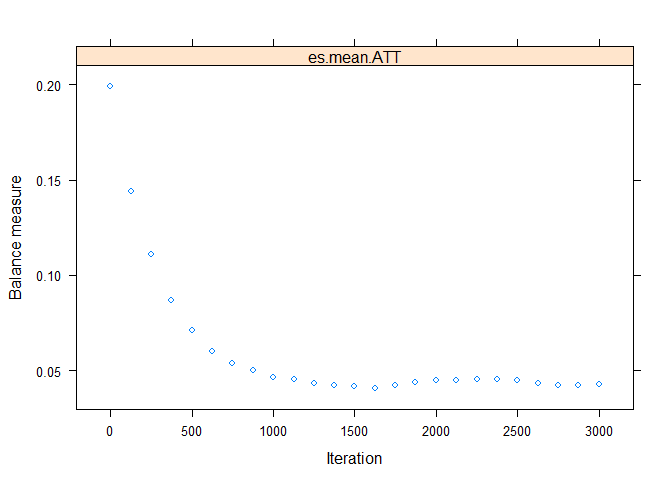<!-- -->

``` r
summary(ps.toy)
```

    ##             n.treat n.ctrl ess.treat ess.ctrl     max.es    mean.es    max.ks
    ## unw             698    298       698   298.00 0.36544982 0.19933096 0.1884195
    ## es.mean.ATT     698    298       698   172.19 0.08373615 0.04075872 0.0388038
    ##             max.ks.p    mean.ks iter
    ## unw               NA 0.09791845   NA
    ## es.mean.ATT       NA 0.02469335 1628

``` r
plot(ps.toy, plots = 2)
```

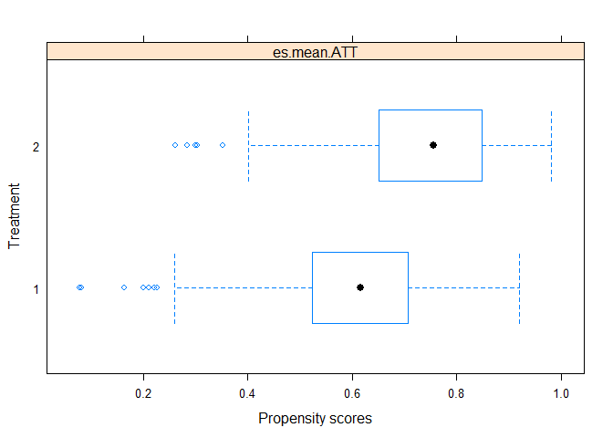<!-- -->

``` r
plot(ps.toy, plots = 3)
```

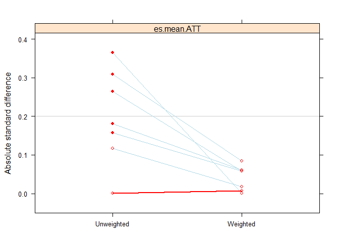<!-- -->

``` r
bal.tab(ps.toy, full.stop.method = "es.mean.att")
```

    ## Call
    ##  ps(formula = treated ~ stent + height + female + diabetic + acutemi + 
    ##     ejecfrac + ves1proc, data = lindner_clean_df, n.trees = 3000, 
    ##     interaction.depth = 2, verbose = FALSE, estimand = "ATT", 
    ##     stop.method = c("es.mean"))
    ## 
    ## Balance Measures
    ##                Type Diff.Adj
    ## prop.score Distance   0.2497
    ## stent        Binary   0.0263
    ## height      Contin.  -0.0068
    ## female       Binary   0.0082
    ## diabetic     Binary  -0.0235
    ## acutemi      Binary   0.0321
    ## ejecfrac    Contin.  -0.0614
    ## ves1proc    Contin.   0.0001
    ## 
    ## Effective sample sizes
    ##            Control Treated
    ## Unadjusted  298.00     698
    ## Adjusted    172.19     698

``` r
p <- love.plot(bal.tab(ps.toy),
threshold = .1, size = 1.5,
title = "Standardized Differences and TWANG ATT Weighting")
```

    ## Warning: Standardized mean differences and raw mean differences are present in the same plot. 
    ## Use the 'stars' argument to distinguish between them and appropriately label the x-axis.

``` r
p + theme_bw()
```

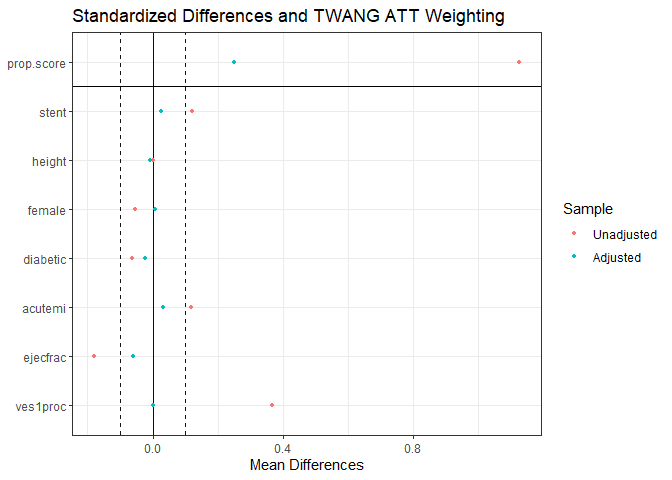<!-- -->

Compared to the manual ATT/ATE weights, the standardized differences
look a bit worse here.

## Estimated effect on outcomes after TWANG ATT weighting

### Quantitative outcome

``` r
toywt3.design <- svydesign(ids=~1,
weights=~get.weights(ps.toy,
stop.method = "es.mean"),
data=lindner_clean) # using twang ATT weights

adjout1.wt3 <- svyglm(cardbill ~ treated, design=toywt3.design)
wt_twangatt_results1 <- tidy(adjout1.wt3, conf.int = TRUE) %>% filter(term == "treated")
wt_twangatt_results1
```

    ## # A tibble: 1 x 7
    ##   term    estimate std.error statistic p.value conf.low conf.high
    ##   <chr>      <dbl>     <dbl>     <dbl>   <dbl>    <dbl>     <dbl>
    ## 1 treated     501.     1102.     0.454   0.650   -1660.     2661.

**Estimate (95%CI)** 500.51 (-1660.15, 2661.17)

### Binary outcome

``` r
adjout2.wt3 <- svyglm(sixMonthSurvive ~ treated, design=toywt3.design,
family=quasibinomial())

wt_twangatt_results2 <- tidy(adjout2.wt3, conf.int = TRUE, exponentiate = TRUE) %>%
filter(term == "treated")
wt_twangatt_results2
```

    ## # A tibble: 1 x 7
    ##   term    estimate std.error statistic p.value conf.low conf.high
    ##   <chr>      <dbl>     <dbl>     <dbl>   <dbl>    <dbl>     <dbl>
    ## 1 treated     4.02     0.487      2.86 0.00438     1.55      10.4

**Estimate (95%CI)** 4.02 (1.55, 10.44)

# Task 11: After direct adjustment with linear PS

Here we’ll directly adjust for the linear PS by including it as a
covariate in the model.

## Quantitative outcome

``` r
direct_out1 <- lm(cardbill ~ treated + linps, data=lindner_clean)

adj_out1 <- tidy(direct_out1, conf.int = TRUE) %>% filter(term == "treated")
adj_out1
```

    ## # A tibble: 1 x 7
    ##   term    estimate std.error statistic p.value conf.low conf.high
    ##   <chr>      <dbl>     <dbl>     <dbl>   <dbl>    <dbl>     <dbl>
    ## 1 treated    1168.      805.      1.45   0.147    -412.     2748.

**Estimate (95%CI)** 1167.9 (-412.22, 2748.02)

## Binary outcome

``` r
direct_out2 <- glm(sixMonthSurvive ~ treated + linps, data=lindner_clean, family=binomial())

adj_out2 <- tidy(direct_out2, exponentiate = TRUE, conf.int = TRUE) %>%
filter(term == "treated")
adj_out2
```

    ## # A tibble: 1 x 7
    ##   term    estimate std.error statistic  p.value conf.low conf.high
    ##   <chr>      <dbl>     <dbl>     <dbl>    <dbl>    <dbl>     <dbl>
    ## 1 treated     4.64     0.438      3.50 0.000463     1.99      11.3

**Estimate/OR (95%CI)** 4.64 (1.99, 11.27)

# Task 12: “Double Robust” Approach: Weighting + Direct Adjustment

Here we’ll adjust for the linear propensity score and the ATT/ATE/TWANG
weights when predicting the Quantitative outcome.

## Quantitative outcome

### ATT weights

``` r
design_att <- svydesign(ids=~1, weights=~wts1, data=lindner_clean) # using ATT weights

dr.out1.wt1 <- svyglm(cardbill ~ treated + linps, design=design_att)
dr_att_out1 <- tidy(dr.out1.wt1, conf.int = TRUE) %>% filter(term == "treated")
dr_att_out1
```

    ## # A tibble: 1 x 7
    ##   term    estimate std.error statistic p.value conf.low conf.high
    ##   <chr>      <dbl>     <dbl>     <dbl>   <dbl>    <dbl>     <dbl>
    ## 1 treated    -127.     1217.    -0.104   0.917   -2511.     2258.

**Estimate (95%CI)** -126.72 (-2511.33, 2257.89)

### ATE weights

``` r
design_ate<- svydesign(ids=~1, weights=~wts2, data=lindner_clean) # using ATE weights

dr.out1.wt2 <- svyglm(cardbill ~ treated + linps, design=design_ate)
dr_ate_out1 <- tidy(dr.out1.wt2, conf.int = TRUE) %>% filter(term == "treated")
dr_ate_out1
```

    ## # A tibble: 1 x 7
    ##   term    estimate std.error statistic p.value conf.low conf.high
    ##   <chr>      <dbl>     <dbl>     <dbl>   <dbl>    <dbl>     <dbl>
    ## 1 treated     217.     1069.     0.203   0.839   -1879.     2312.

**Estimate (95%CI)** 216.77 (-1878.59, 2312.13)

### TWANG ATT weights

``` r
wts3 <- get.weights(ps.toy, stop.method = "es.mean")
twang.design <- svydesign(ids=~1, weights=~wts3, data=lindner_clean) # twang ATT weights

dr.out1.wt3 <- svyglm(cardbill ~ treated + linps, design=twang.design)
dr_twangatt_out1 <- tidy(dr.out1.wt3, conf.int = TRUE) %>% filter(term == "treated")
dr_twangatt_out1
```

    ## # A tibble: 1 x 7
    ##   term    estimate std.error statistic p.value conf.low conf.high
    ##   <chr>      <dbl>     <dbl>     <dbl>   <dbl>    <dbl>     <dbl>
    ## 1 treated     375.     1103.     0.340   0.734   -1787.     2537.

**Estimate (95%CI)** 375.05 (-1787.05, 2537.16)

## Binary outcome

Now we’ll adjust for the linear propensity score and the ATT/ATE/TWANG
weights when predicting the binary outcome.

### ATT weights

``` r
dr.out2.wt1 <- svyglm(sixMonthSurvive ~ treated + linps, design=design_att,
family=quasibinomial())

dr_att_out2 <- tidy(dr.out2.wt1, exponentiate = TRUE, conf.int = TRUE) %>%
filter(term == "treated")
dr_att_out2
```

    ## # A tibble: 1 x 7
    ##   term    estimate std.error statistic  p.value conf.low conf.high
    ##   <chr>      <dbl>     <dbl>     <dbl>    <dbl>    <dbl>     <dbl>
    ## 1 treated     6.90     0.563      3.43 0.000634     2.29      20.8

**Estimate (95%CI)** 6.9 (2.29, 20.81)

### ATE weights

``` r
dr.out2.wt2 <- svyglm(sixMonthSurvive ~ treated + linps, design=design_ate,
family=quasibinomial())

dr_ate_out2 <- tidy(dr.out2.wt2, exponentiate = TRUE, conf.int = TRUE) %>%
filter(term == "treated")
dr_ate_out2
```

    ## # A tibble: 1 x 7
    ##   term    estimate std.error statistic  p.value conf.low conf.high
    ##   <chr>      <dbl>     <dbl>     <dbl>    <dbl>    <dbl>     <dbl>
    ## 1 treated     5.95     0.517      3.45 0.000590     2.16      16.4

**Estimate (95%CI)** 5.95 (2.16, 16.39)

### TWANG ATT weights

``` r
dr.out2.wt3 <- svyglm(sixMonthSurvive ~ treated + linps, design=twang.design,
family=quasibinomial())

dr_twangatt_out2 <- tidy(dr.out2.wt3, exponentiate = TRUE, conf.int = TRUE) %>%
filter(term == "treated")
dr_twangatt_out2
```

    ## # A tibble: 1 x 7
    ##   term    estimate std.error statistic p.value conf.low conf.high
    ##   <chr>      <dbl>     <dbl>     <dbl>   <dbl>    <dbl>     <dbl>
    ## 1 treated     4.87     0.554      2.86 0.00436     1.64      14.4

**Estimate (95%CI)** 4.87 (1.64, 14.44)

``` r
sessioninfo::session_info()
```

    ## - Session info ---------------------------------------------------------------
    ##  setting  value                       
    ##  version  R version 3.6.2 (2019-12-12)
    ##  os       Windows 10 x64              
    ##  system   x86_64, mingw32             
    ##  ui       RTerm                       
    ##  language (EN)                        
    ##  collate  English_United States.1252  
    ##  ctype    English_United States.1252  
    ##  tz       America/New_York            
    ##  date     2020-01-27                  
    ## 
    ## - Packages -------------------------------------------------------------------
    ##  package      * version    date       lib source        
    ##  acepack        1.4.1      2016-10-29 [1] CRAN (R 3.6.1)
    ##  assertthat     0.2.1      2019-03-21 [1] CRAN (R 3.6.1)
    ##  backports      1.1.5      2019-10-02 [1] CRAN (R 3.6.1)
    ##  base64enc      0.1-3      2015-07-28 [1] CRAN (R 3.6.0)
    ##  boot           1.3-24     2019-12-20 [1] CRAN (R 3.6.2)
    ##  broom        * 0.5.3      2019-12-14 [1] CRAN (R 3.6.2)
    ##  cellranger     1.1.0      2016-07-27 [1] CRAN (R 3.6.1)
    ##  checkmate      1.9.4      2019-07-04 [1] CRAN (R 3.6.1)
    ##  class          7.3-15     2019-01-01 [2] CRAN (R 3.6.2)
    ##  cli            2.0.1      2020-01-08 [1] CRAN (R 3.6.2)
    ##  cluster        2.1.0      2019-06-19 [2] CRAN (R 3.6.2)
    ##  cmprsk         2.2-9      2019-10-09 [1] CRAN (R 3.6.1)
    ##  cobalt       * 4.0.0      2020-01-08 [1] CRAN (R 3.6.2)
    ##  colorspace     1.4-1      2019-03-18 [1] CRAN (R 3.6.1)
    ##  crayon         1.3.4      2017-09-16 [1] CRAN (R 3.6.1)
    ##  crosstalk      1.0.0      2016-12-21 [1] CRAN (R 3.6.1)
    ##  data.table     1.12.8     2019-12-09 [1] CRAN (R 3.6.1)
    ##  DBI            1.1.0      2019-12-15 [1] CRAN (R 3.6.1)
    ##  dbplyr         1.4.2      2019-06-17 [1] CRAN (R 3.6.1)
    ##  digest         0.6.23     2019-11-23 [1] CRAN (R 3.6.1)
    ##  dplyr        * 0.8.3      2019-07-04 [1] CRAN (R 3.6.1)
    ##  e1071          1.7-3      2019-11-26 [1] CRAN (R 3.6.1)
    ##  ellipsis       0.3.0      2019-09-20 [1] CRAN (R 3.6.1)
    ##  Epi            2.40       2019-11-25 [1] CRAN (R 3.6.2)
    ##  etm            1.0.5      2019-05-28 [1] CRAN (R 3.6.1)
    ##  evaluate       0.14       2019-05-28 [1] CRAN (R 3.6.1)
    ##  fansi          0.4.1      2020-01-08 [1] CRAN (R 3.6.2)
    ##  farver         2.0.3      2020-01-16 [1] CRAN (R 3.6.2)
    ##  fastmap        1.0.1      2019-10-08 [1] CRAN (R 3.6.1)
    ##  forcats      * 0.4.0      2019-02-17 [1] CRAN (R 3.6.1)
    ##  foreign        0.8-74     2019-12-26 [1] CRAN (R 3.6.2)
    ##  Formula        1.2-3      2018-05-03 [1] CRAN (R 3.6.0)
    ##  fs             1.3.1      2019-05-06 [1] CRAN (R 3.6.1)
    ##  gbm          * 2.1.5      2019-01-14 [1] CRAN (R 3.6.2)
    ##  generics       0.0.2      2018-11-29 [1] CRAN (R 3.6.1)
    ##  ggdendro       0.1-20     2016-04-27 [1] CRAN (R 3.6.1)
    ##  ggformula      0.9.2      2019-09-05 [1] CRAN (R 3.6.1)
    ##  ggplot2      * 3.2.1      2019-08-10 [1] CRAN (R 3.6.1)
    ##  ggrepel        0.8.1      2019-05-07 [1] CRAN (R 3.6.2)
    ##  ggstance       0.3.3      2019-08-19 [1] CRAN (R 3.6.1)
    ##  glue           1.3.1      2019-03-12 [1] CRAN (R 3.6.2)
    ##  gridExtra      2.3        2017-09-09 [1] CRAN (R 3.6.2)
    ##  gtable         0.3.0      2019-03-25 [1] CRAN (R 3.6.1)
    ##  haven          2.2.0      2019-11-08 [1] CRAN (R 3.6.1)
    ##  here         * 0.1        2017-05-28 [1] CRAN (R 3.6.2)
    ##  Hmisc          4.3-0      2019-11-07 [1] CRAN (R 3.6.2)
    ##  hms            0.5.3      2020-01-08 [1] CRAN (R 3.6.2)
    ##  htmlTable      1.13.3     2019-12-04 [1] CRAN (R 3.6.1)
    ##  htmltools      0.4.0      2019-10-04 [1] CRAN (R 3.6.1)
    ##  htmlwidgets    1.5.1      2019-10-08 [1] CRAN (R 3.6.1)
    ##  httpuv         1.5.2      2019-09-11 [1] CRAN (R 3.6.1)
    ##  httr           1.4.1      2019-08-05 [1] CRAN (R 3.6.1)
    ##  janitor      * 1.2.0      2019-04-21 [1] CRAN (R 3.6.1)
    ##  jpeg           0.1-8.1    2019-10-24 [1] CRAN (R 3.6.1)
    ##  jsonlite       1.6        2018-12-07 [1] CRAN (R 3.6.1)
    ##  knitr          1.27       2020-01-16 [1] CRAN (R 3.6.2)
    ##  labeling       0.3        2014-08-23 [1] CRAN (R 3.6.0)
    ##  labelled       2.2.1      2019-05-26 [1] CRAN (R 3.6.1)
    ##  later          1.0.0      2019-10-04 [1] CRAN (R 3.6.1)
    ##  lattice      * 0.20-38    2018-11-04 [1] CRAN (R 3.6.2)
    ##  latticeExtra * 0.6-29     2019-12-19 [1] CRAN (R 3.6.2)
    ##  lazyeval       0.2.2      2019-03-15 [1] CRAN (R 3.6.1)
    ##  leaflet        2.0.3      2019-11-16 [1] CRAN (R 3.6.1)
    ##  lifecycle      0.1.0      2019-08-01 [1] CRAN (R 3.6.1)
    ##  lme4         * 1.1-21     2019-03-05 [1] CRAN (R 3.6.2)
    ##  lubridate      1.7.4      2018-04-11 [1] CRAN (R 3.6.1)
    ##  magrittr     * 1.5        2014-11-22 [1] CRAN (R 3.6.2)
    ##  MASS         * 7.3-51.5   2019-12-20 [1] CRAN (R 3.6.2)
    ##  Matching     * 4.9-6      2019-05-07 [1] CRAN (R 3.6.2)
    ##  Matrix       * 1.2-18     2019-11-27 [2] CRAN (R 3.6.2)
    ##  mgcv           1.8-31     2019-11-09 [2] CRAN (R 3.6.2)
    ##  mime           0.8        2019-12-19 [1] CRAN (R 3.6.2)
    ##  minqa          1.2.4      2014-10-09 [1] CRAN (R 3.6.1)
    ##  mitools        2.4        2019-04-26 [1] CRAN (R 3.6.1)
    ##  modelr         0.1.5      2019-08-08 [1] CRAN (R 3.6.1)
    ##  mosaic         1.5.0      2019-01-12 [1] CRAN (R 3.6.2)
    ##  mosaicCore     0.6.0      2018-06-24 [1] CRAN (R 3.6.1)
    ##  mosaicData     0.17.0     2018-06-23 [1] CRAN (R 3.6.1)
    ##  munsell        0.5.0      2018-06-12 [1] CRAN (R 3.6.1)
    ##  nlme           3.1-142    2019-11-07 [2] CRAN (R 3.6.2)
    ##  nloptr         1.2.1      2018-10-03 [1] CRAN (R 3.6.1)
    ##  nnet           7.3-12     2016-02-02 [2] CRAN (R 3.6.2)
    ##  numDeriv       2016.8-1.1 2019-06-06 [1] CRAN (R 3.6.0)
    ##  patchwork    * 1.0.0      2019-12-01 [1] CRAN (R 3.6.1)
    ##  pillar         1.4.3      2019-12-20 [1] CRAN (R 3.6.2)
    ##  pkgconfig      2.0.3      2019-09-22 [1] CRAN (R 3.6.1)
    ##  plyr           1.8.5      2019-12-10 [1] CRAN (R 3.6.1)
    ##  png            0.1-7      2013-12-03 [1] CRAN (R 3.6.0)
    ##  promises       1.1.0      2019-10-04 [1] CRAN (R 3.6.1)
    ##  purrr        * 0.3.3      2019-10-18 [1] CRAN (R 3.6.1)
    ##  R6             2.4.1      2019-11-12 [1] CRAN (R 3.6.1)
    ##  RColorBrewer   1.1-2      2014-12-07 [1] CRAN (R 3.6.0)
    ##  Rcpp           1.0.3      2019-11-08 [1] CRAN (R 3.6.1)
    ##  readr        * 1.3.1      2018-12-21 [1] CRAN (R 3.6.1)
    ##  readxl         1.3.1      2019-03-13 [1] CRAN (R 3.6.1)
    ##  reprex         0.3.0      2019-05-16 [1] CRAN (R 3.6.1)
    ##  rlang          0.4.2      2019-11-23 [1] CRAN (R 3.6.1)
    ##  rmarkdown      2.0        2019-12-12 [1] CRAN (R 3.6.2)
    ##  rpart          4.1-15     2019-04-12 [2] CRAN (R 3.6.2)
    ##  rprojroot      1.3-2      2018-01-03 [1] CRAN (R 3.6.1)
    ##  rstudioapi     0.10       2019-03-19 [1] CRAN (R 3.6.1)
    ##  rvest          0.3.5      2019-11-08 [1] CRAN (R 3.6.1)
    ##  scales         1.1.0      2019-11-18 [1] CRAN (R 3.6.1)
    ##  sessioninfo    1.1.1      2018-11-05 [1] CRAN (R 3.6.1)
    ##  shiny          1.4.0      2019-10-10 [1] CRAN (R 3.6.1)
    ##  stringi        1.4.5      2020-01-11 [1] CRAN (R 3.6.2)
    ##  stringr      * 1.4.0      2019-02-10 [1] CRAN (R 3.6.1)
    ##  survey       * 3.36       2019-04-27 [1] CRAN (R 3.6.2)
    ##  survival     * 3.1-8      2019-12-03 [1] CRAN (R 3.6.2)
    ##  tableone     * 0.10.0     2019-02-17 [1] CRAN (R 3.6.2)
    ##  tibble       * 2.1.3      2019-06-06 [1] CRAN (R 3.6.1)
    ##  tidyr        * 1.0.0      2019-09-11 [1] CRAN (R 3.6.1)
    ##  tidyselect     0.2.5      2018-10-11 [1] CRAN (R 3.6.1)
    ##  tidyverse    * 1.3.0      2019-11-21 [1] CRAN (R 3.6.2)
    ##  twang        * 1.5        2017-07-02 [1] CRAN (R 3.6.2)
    ##  utf8           1.1.4      2018-05-24 [1] CRAN (R 3.6.1)
    ##  vctrs          0.2.1      2019-12-17 [1] CRAN (R 3.6.2)
    ##  withr          2.1.2      2018-03-15 [1] CRAN (R 3.6.1)
    ##  xfun           0.12       2020-01-13 [1] CRAN (R 3.6.2)
    ##  xml2           1.2.2      2019-08-09 [1] CRAN (R 3.6.1)
    ##  xtable       * 1.8-4      2019-04-21 [1] CRAN (R 3.6.1)
    ##  yaml           2.2.0      2018-07-25 [1] CRAN (R 3.6.0)
    ##  zeallot        0.1.0      2018-01-28 [1] CRAN (R 3.6.1)
    ##  zoo            1.8-7      2020-01-10 [1] CRAN (R 3.6.2)
    ## 
    ## [1] C:/Users/Thomas/Documents/R/win-library/3.6
    ## [2] C:/Program Files/R/R-3.6.2/library
